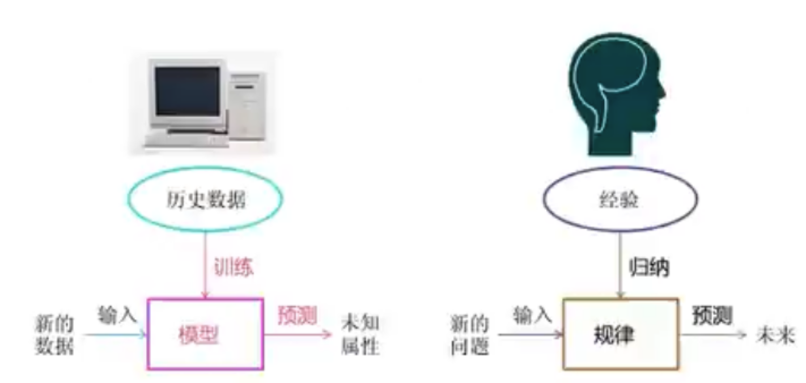
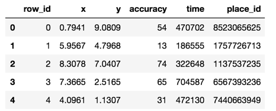
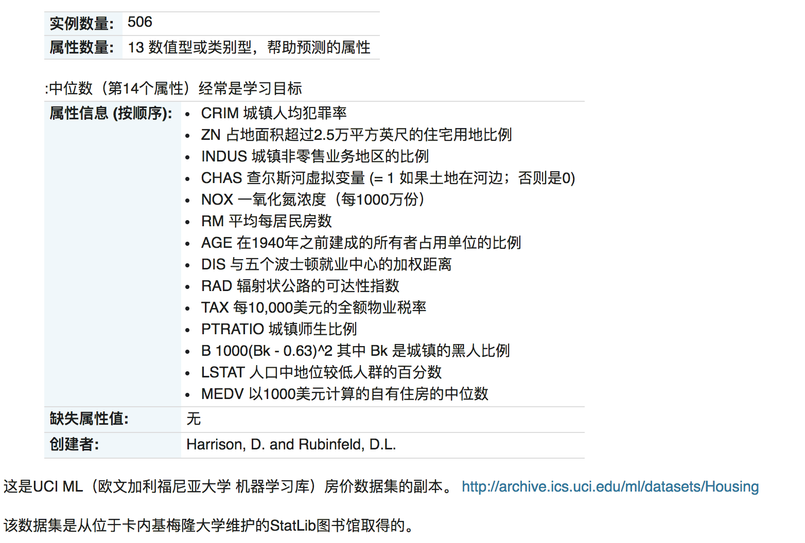
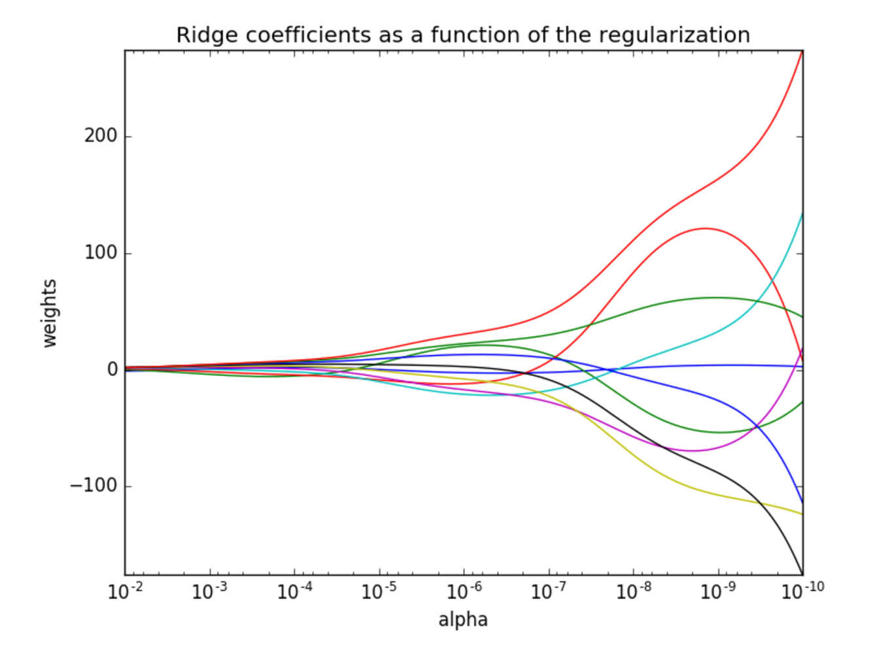

<p align="center">
 
 <h1 align="center">机器学习</h2>
 <p align="center"><b>基于 scikit-learn 库</b></p>
</p>

<div align=center>


[](LICENSE)


<div align=left>
<!-- 顶部至此截止 -->


[toc]


# 概述

## 人工智能、机器学习、深度学习的关系


- 机器学习和人工智能，深度学习的关系

    机器学习是人工智能的一个实现途径

    深度学习是机器学习的一个方法（神经网络）发展而来


## 什么是机器学习

机器学习是从数据中自动分析获得模型，并利用模型对未知数据进行预测。

也就是说，通过**数据**来得到一个**模型**，然后再拿着这个模型去**预测**



 

## 机器学习应用场景


- 用在挖掘、预测领域：

    ​	应用场景：店铺销量预测、量化投资、广告推荐、企业客户分类、SQL语句安全检测分类...

    

- 用在图像领域：

    ​	应用场景：街道交通标志检测、人脸识别等等

    

- 用在自然语言处理领域：

    ​	应用场景：文本分类、情感分析、自动聊天、文本检测等等


---


# 机器学习的算法

## 算法的大致分类

| 特征值                     | 目标值                           | 问题描述                 | 举例                                               |
| -------------------------- | -------------------------------- | ------------------------ | -------------------------------------------------- |
| （比如：猫狗的图片）       | **类别**（比如：猫还是狗）       | **分类问题**（监督学习） | k-临近算法、贝叶斯分类、决策树与随机森林、逻辑回归 |
| （比如：房屋面积、位置等） | **连续型数据**（比如：房屋价格） | **回归问题**（监督学习） | 线性回归、岭回归                                   |
|                            | **没有目标值**                   | **聚类**（无监督学习）   | k-means                                            |
|                            |                                  |                          |                                                    |


**举例：**

- 预测明天的气温是多少度？

    ​	回归问题

    

- 预测明天是阴、晴还是雨？

    ​	分类问题

    

- 人脸年龄预测？

    ​	回归或分类，取决如如何定义年龄

    

- 人脸识别？

    ​	分类


## 机器学习类型（算法）描述

| 类型       | 特点                               | 定义或是由                                                   | 代表                                                         |
| ---------- | ---------------------------------- | ------------------------------------------------------------ | ------------------------------------------------------------ |
| 监督学习   | 有数据、有标签                     | **输入的数据是由特征值和目标值**所构成。**函数的输出可以是一个连续的值（称为回归）**或是**输出是有限个离散值（称作分类）** | **分类：**<br />k-临近算法、贝叶斯分类、决策树与随机森林、逻辑回归<br /><br />**回归：**<br />线性回归、岭回归 |
| 非监督学习 | 有数据、无标签                     | **输入的数据是由特征值和目标值**所构成                       | 聚类：<br />k-means                                          |
| 半监督学习 | 结合监督学习和非监督学习           |                                                              |                                                              |
| 强化学习   | 从经验中总结提升                   |                                                              |                                                              |
| 遗传算法   | 和强化学习类似，适者生存不适者淘汰 |                                                              |                                                              |


### 监督学习

**监督学习**（英语：Supervised learning），又叫有监督学习，监督式学习，是[机器学习](https://zh.wikipedia.org/wiki/机器学习)的一种方法，可以由训练资料中学到或建立一个模式（函数 / learning model），并依此模式推测新的实例。[[1\]](https://zh.wikipedia.org/wiki/监督学习#cite_note-1)[训练资料](https://zh.wikipedia.org/wiki/訓練資料)是由输入物件（通常是向量）和预期输出所组成。函数的输出可以是一个连续的值（称为[回归分析](https://zh.wikipedia.org/wiki/迴歸分析)），或是预测一个分类标签（称作[分类](https://zh.wikipedia.org/wiki/分类)）。

监督式学习有两种形态的模型。最一般的，监督式学习产生一个全域模型，会将输入物件对应到预期输出。而另一种，则是将这种对应实作在一个区域模型。（如[案例推论](https://zh.wikipedia.org/wiki/案例推论)及[最近邻居法](https://zh.wikipedia.org/wiki/最近鄰居法)）。为了解决一个给定的监督式学习的问题（[手写辨识](https://zh.wikipedia.org/wiki/手写识别)），必须考虑以下步骤：

1. 决定训练资料的范例的形态。在做其它事前，工程师应决定要使用哪种资料为范例。譬如，可能是一个手写字符，或一整个手写的辞汇，或一行手写文字。
2. 搜集训练资料。这资料须要具有真实世界的特征。所以，可以由人类专家或（机器或感测器的）测量中得到输入物件和其相对应输出。
3. 决定学习函数的输入特征的表示法。学习函数的准确度与输入的物件如何表示是有很大的关联度。传统上，输入的物件会被转成一个特征向量，包含了许多关于描述物件的特征。因为[维数灾难](https://zh.wikipedia.org/wiki/维数灾难)的关系，特征的个数不宜太多，但也要足够大，才能准确的预测输出。
4. 决定要学习的函数和其对应的学习演算法所使用的资料结构。譬如，工程师可能选择[人工神经网路](https://zh.wikipedia.org/wiki/人工神经网络)和[决策树](https://zh.wikipedia.org/wiki/决策树)。
5. 完成设计。工程师接著在搜集到的资料上跑学习演算法。可以借由将资料跑在资料的子集（称为*验证集*）或[交叉验证](https://zh.wikipedia.org/wiki/交叉驗證)（cross-validation）上来调整学习演算法的参数。参数调整后，演算法可以运行在不同于训练集的测试集上

另外对于监督式学习所使用的辞汇则是分类。现著有著各式的分类器，各自都有强项或弱项。分类器的表现很大程度上地跟要被分类的资料特性有关。并没有某一单一分类器可以在所有给定的问题上都表现最好，这被称为‘天下没有白吃的午餐理论’。各式的经验法则被用来比较分类器的表现及寻找会决定分类器表现的资料特性。决定适合某一问题的分类器仍旧是一项艺术，而非科学。

目前最广泛被使用的分类器有[人工神经网路](https://zh.wikipedia.org/wiki/人工神经网络)、[支持向量机](https://zh.wikipedia.org/wiki/支持向量机)、[最近邻居法](https://zh.wikipedia.org/wiki/最近鄰居法)、[高斯混合模型](https://zh.wikipedia.org/wiki/高斯混合模型)、[朴素贝叶斯方法](https://zh.wikipedia.org/wiki/朴素贝叶斯分类器)、[决策树](https://zh.wikipedia.org/wiki/决策树)和[径向基函数分类](https://zh.wikipedia.org/w/index.php?title=径向基函数分类&action=edit&redlink=1)。


**比如：**

我们给计算机一堆图片，并告诉他们那些是猫、哪些是狗。让计算机去分辨猫或狗，通过这种指引的方式让计算机学习我们是如何把这些图片数据对应到图片上所代表的的物体，并赋予这些图片猫或狗的标签。预测房屋的价格，股票的涨停同样可以用监督学期来实现。

神经网络同样是一种监督学习的方式

---


### 无监督学习

**无监督学习**（英语：unsupervised learning）是[机器学习](https://zh.wikipedia.org/wiki/机器学习)的一种方法，没有给定事先标记过的训练范例，自动对输入的资料进行分类或分群。无监督学习的主要运用包含：[聚类分析](https://zh.wikipedia.org/wiki/聚类分析)（cluster analysis）、[关联规则](https://zh.wikipedia.org/wiki/关联规则学习)（association rule）、维度缩减（dimensionality reduce）。它是[监督式学习](https://zh.wikipedia.org/wiki/監督式學習)和[强化学习](https://zh.wikipedia.org/wiki/强化学习)等策略之外的一种选择。

一个常见的无监督学习是[数据聚类](https://zh.wikipedia.org/wiki/数据聚类)。在[人工神经网路](https://zh.wikipedia.org/wiki/人工神经网络)中，[生成对抗网络](https://zh.wikipedia.org/wiki/生成对抗网络)（GAN）、[自组织映射](https://zh.wikipedia.org/wiki/自组织映射)（SOM）和[适应性共振理论](https://zh.wikipedia.org/w/index.php?title=適應性共振理論&action=edit&redlink=1)（ART）则是最常用的非监督式学习。

ART模型允许丛集的个数可随著问题的大小而变动，并让使用者控制成员和同一个丛集之间的相似度分数，其方式为透过一个由使用者自定而被称为[警觉参数](https://zh.wikipedia.org/w/index.php?title=警覺參數&action=edit&redlink=1)的常数。ART也用于[模式识别](https://zh.wikipedia.org/wiki/模式识别)，如[自动目标辨识](https://zh.wikipedia.org/w/index.php?title=自動目標辨識&action=edit&redlink=1)和[数位信号处理](https://zh.wikipedia.org/wiki/數位信號處理)。第一个版本为"ART1"，是由卡本特和葛罗斯柏格所发展的。


**比如：**

我们给计算机一堆图片，但并**不**告诉他们那些是猫、哪些是狗。让计算机自己去分辨这些图片中的不同之处，自己去判断或分类。在这一种学习过程中，我们可以不用提供数据所对应的标签信息，计算机通过观察各种数据之间的特性，会发现这些特性背后的规律

---


### 半监督学习

**半监督学习**是一种[机器学习](https://en.wikipedia.org/wiki/Machine_learning)方法，它在训练过程中将少量[标记数据](https://en.wikipedia.org/wiki/Labeled_data)与大量未标记数据相结合。半监督学习介于[无监督学习](https://en.wikipedia.org/wiki/Unsupervised_learning)（没有标记的训练数据）和[监督学习](https://en.wikipedia.org/wiki/Supervised_learning)（只有标记的训练数据）之间。它是[弱监督的](https://en.wikipedia.org/wiki/Weak_supervision)一个特例。

未标记数据与少量标记数据结合使用时，可以显着提高学习准确性。为学习问题获取标记数据通常需要熟练的人类代理（例如转录音频片段）或物理实验（例如确定蛋白质的 3D 结构或确定特定位置是否有油）。因此，与标记过程相关的成本可能会使大型、完全标记的训练集变得不可行，而未标记数据的获取相对便宜。在这种情况下，半监督学习具有很大的实用价值。半监督学习在机器学习和作为人类学习的模型方面也具有理论意义。

**它主要考虑如何利用少量有标签的样本和大量的没有标签样本进行训练和分类**

---


### 强化学习

**强化学习**（英语：Reinforcement learning，简称RL）是[机器学习](https://zh.wikipedia.org/wiki/机器学习)中的一个领域，强调如何基于[环境](https://zh.wikipedia.org/wiki/环境)而行动，以取得最大化的预期利益[[1\]](https://zh.wikipedia.org/wiki/强化学习#cite_note-1)。强化学习是除了[监督学习](https://zh.wikipedia.org/wiki/监督学习)和[非监督学习](https://zh.wikipedia.org/w/index.php?title=非监督学习&action=edit&redlink=1)之外的第三种基本的机器学习方法。与监督学习不同的是，强化学习不需要带标签的输入输出对，同时也无需对非最优解的精确地纠正。其关注点在于寻找探索（对未知领域的）和利用（对已有知识的）的平衡[[2\]](https://zh.wikipedia.org/wiki/强化学习#cite_note-kaelbling-2)，强化学习中的“探索-利用”的交换，在[多臂老虎机](https://zh.wikipedia.org/w/index.php?title=多臂老虎机&action=edit&redlink=1)问题和有限MDP中研究得最多。。

其灵感来源于心理学中的[行为主义](https://zh.wikipedia.org/wiki/行为主义)理论，即有机体如何在环境给予的奖励或惩罚的刺激下，逐步形成对刺激的预期，产生能获得最大利益的习惯性行为。这个方法具有普适性，因此在其他许多领域都有研究，例如[博弈论](https://zh.wikipedia.org/wiki/博弈论)、[控制论](https://zh.wikipedia.org/wiki/控制论)、[运筹学](https://zh.wikipedia.org/wiki/运筹学)、[信息论](https://zh.wikipedia.org/wiki/信息论)、仿真优化、[多智能体系统](https://zh.wikipedia.org/wiki/多智能体系统)、[群体智能](https://zh.wikipedia.org/wiki/群体智能)、[统计学](https://zh.wikipedia.org/wiki/统计学)以及[遗传算法](https://zh.wikipedia.org/wiki/遗传算法)。在运筹学和控制理论研究的语境下，强化学习被称作“近似动态规划”（approximate dynamic programming，ADP）。在[最优控制](https://zh.wikipedia.org/wiki/最优控制)理论中也有研究这个问题，虽然大部分的研究是关于最优解的存在和特性，并非是学习或者近似方面。在[经济学](https://zh.wikipedia.org/wiki/经济学)和[博弈论](https://zh.wikipedia.org/wiki/博弈论)中，强化学习被用来解释在[有限理性](https://zh.wikipedia.org/wiki/有限理性)的条件下如何出现平衡。

在机器学习问题中，环境通常被抽象为[马尔可夫决策过程](https://zh.wikipedia.org/wiki/马尔可夫决策过程)（Markov decision processes，MDP），因为很多强化学习算法在这种假设下才能使用[动态规划](https://zh.wikipedia.org/wiki/动态规划)的方法[[3\]](https://zh.wikipedia.org/wiki/强化学习#cite_note-3)。传统的动态规划方法和强化学习算法的主要区别是，后者不需要关于MDP的知识，而且针对无法找到确切方法的大规模MDP。[[4\]](https://zh.wikipedia.org/wiki/强化学习#cite_note-4)

比如：

在规划机器人的行为准则方面，(REINFORCEMENTLEARNING)  这种机器学习方法叫作“强化学习。也就是把计算机丢到了一个对于它完全陌生的环境或者让它完成一项从未接触过的任务，它会去尝试各种手段，最后让自己成功适应这个陌生环境，或者学会完成这件任务的方法途经。

比如我想训练机器人去投篮，我只需要给他一个球。并告诉他，你投进了我给你记一分，让它自己去尝试各种各样的投篮方法。在开始阶段，他的命中率可能非常低，不过他会像人类一样自己去总结投篮失败或成功的经验，最后达到很高的命中率。Google 的 AlphaGo 也就是应用了这一种学习的方式

---


### 遗传算法

**遗传算法**（英语：Genetic Algorithm, **GA** ）是[计算数学](https://zh.wikipedia.org/wiki/计算数学)中用于解决[最佳化](https://zh.wikipedia.org/wiki/最佳化)的搜索[算法](https://zh.wikipedia.org/wiki/算法)，是[进化算法](https://zh.wikipedia.org/wiki/进化算法)的一种。进化算法最初是借鉴了[进化生物学](https://zh.wikipedia.org/wiki/进化生物学)中的一些现象而发展起来的，这些现象包括[遗传](https://zh.wikipedia.org/wiki/遗传)、[突变](https://zh.wikipedia.org/wiki/突变)、[自然选择](https://zh.wikipedia.org/wiki/自然选择)以及[杂交](https://zh.wikipedia.org/wiki/杂交)等等。

遗传算法通常实现方式为一种[计算机模拟](https://zh.wikipedia.org/wiki/计算机模拟)。对于一个最优化问题，一定数量的[候选解](https://zh.wikipedia.org/w/index.php?title=候选解&action=edit&redlink=1)（称为个体）可抽象表示为[染色体](https://zh.wikipedia.org/wiki/染色體_(遺傳演算法))，使[种群](https://zh.wikipedia.org/wiki/种群)向更好的解进化。传统上，解用[二进制](https://zh.wikipedia.org/wiki/二进制)表示（即0和1的串），但也可以用其他表示方法。进化从完全[随机](https://zh.wikipedia.org/wiki/随机)个体的种群开始，之后一代一代发生。在每一代中评价整个种群的[适应度](https://zh.wikipedia.org/wiki/适应度)，从当前种群中随机地选择多个个体（基于它们的适应度），通过自然选择和突变产生新的生命种群，该种群在算法的下一次迭代中成为当前种群。

遗传算法和强化学习类似，这一种方法是模拟我们熟知的进化理论，淘汰弱者；适者生存。通过这样的淘汰机制去选择最优的设计或模型，比如这位开发者所开发的计算机学会玩超级玛丽最开始的马里奥1代可能不久就牺牲了，不过系统会基于1代的马里奥随机盖成2代，淘汰掉比较弱的马利奥然后再次基于强者“繁衍和变异”

---


# 机器学习的流程

## 开发流程


1. 获取数据
2. 数据处理（处理缺失值等）
3. 特征工程（将数据处理为算法能够使用的数据；特征就是特征值）
4. 使用机器学习算法进行训练（fit） --> 得到模型
5. 模型评估，如果模型不好返回第 2 步继续循环，直到模型评估比较好


## 机器框架和资料

明确：**机器学习算法是核心，数据和计算是基础**


**书籍：**

- 机器学习 - “西瓜书" - 周志华
- 统计学习方法 - 季航
- 深度学习 - “花书"


**库和框架：**

- 传统机器学习框架
    - sklearn	
- 深度学习框架
    - [TensorFlow](https://www.tensorflow.org/?hl=zh-cn)
    - theano
    - Caffe2
    - Pytorch
    - Chainer

---


# 特征工程（概念）

## 数据集

在明确了机器学习的相关概念后，我们知道机器学习需要有数据来训练模型，那么我们的数据又是如何构成的呢？格式又是如何？

- **结构：特征值 + 目标值**

    - 对于**每一行数据**我们可以称之为**样本**
    - 有些数据集可以没有目标值

    

    比如下图的房屋数据：

    **特征值**就可以看作是房屋的面积、位置、楼层、朝向

    **目标值**就可以看做是房屋的价格

    


- **可用数据集**

    - Sklearn
        - Python语言的机器学习工具
        - Scikit-learn 包括许多知名的机器学习算法的实现
        - Scikit-learn文档完善，容易上手，丰富的API

    - Kaggle

    - UCI


## 特征工程介绍

特征工程是对数据的特征进行处理，能使一个算法得到最好的发挥，会直接影响到机器学习效果。

数据和特征决定了机器学习的上限，而模型和算法只是逼近这个上限而已

**工具：**

- `pandas` - 数据清洗，数据处理
- `sklearn` - 特征工程


**特征工程主要包括：**

- 特征抽取（提取）
- 特征预处理
- 特征降维


---

### 特征抽取（提取）

特征值化是为了让计算机更好的去理解数据；将任意数据（图像或文本）转换为可用于机器学习的数字特征

机器学习算法 --> 统计方法 --> 数学公式

- 字典特征提取（特征离散化）
- 文本特征提取
- 图像特征提取（深度学习）

---

### 特征预处理

**目标：**

- 了解数值型数据、类别型数据特点
- 应用 `MinMaxScaler` 实现对特征数据进行**归一化**
- 应用 `StandardScaler` 实现对特征数据进行**标准化**


可见，**特征预处理**就是通过一些转换函数将特征数据转换成更加适合算法模型的特征图数据过程


**特征预处理包含：**

- **归一化**

    通过对原始数据进行变换把数据映射到（默认[0, 1]）之间

    

- **标准化**


**为什么要进行归一化/标准化？**

- 简而言之就是要**统一数量级**，比如在做物理或数学题时我们要把数值的数量级或单位进行统一**使数据无量纲化**。
- 特征的单位或者大小相差较大，或者某特征的方差相比其他的特征要大出几个数量级，容易影响（支配）目标结果，使得一些算法无法学习到其它的特征


---


# sklearn

## 选择 sklearn 的机器学习算法


---


## sklearn-API 汇总

**数据集部分：**

- **【数据结构】`database.base.Bunch`**

    `load` 和 `fetch` **返回**的数据类型是 `datasets.base.Bunch` 也就是一种**基于字典的格式（带有键值对 key-value）** ，可以使用`dict['key']` 和 `bunch.key` 两种方式获得数值

    - `data` - **特征数据数组**，是 `[n_sample * n_sample]` 的二维 **numpy.ndarray** 数组
    - `target` - **目标值数组**，是 n_samples 的一维 **numpy.ndarray** 数组
    - `DESCR` - **数据描述**
    - `feature_namees` - **特征名**；比如：手写数字、新闻数据、回归数据集
    - `target_names` - **目标值名**

    

- **数据集加载/生成**

    ```pytohn
    sklearn.database
    ```

    | 函数/方法                                                    | 描述                                                         |
    | ------------------------------------------------------------ | ------------------------------------------------------------ |
    | `database.load_*()`                                          | **返回**小数据集，**返回**的数据类型是 `datasets.base.Bunch` |
    | `database.fetch_*(datahome=数据集保存到, subset='all')`      | 先从网络下载，再**返回**大数据集；<br />`data_home=`数据集保存路径，默认 `~/sklearn_learn_data`<br />`subset=`加载哪些集合：`all`所有；`train` 训练集；`test`测试集 |
    | `dataset.make_*(n_samples=数据量, n_features=特征数, n_targets=目标值数, noise=噪声)` | **返回**生成的随机的模拟数据                                 |

    

- **数据集划分：**

    ```python
    sklearn.model_selection
    ```

    `x_train, x_test, y_train, y_test = sklearn.model_selection.train_test_split(x=特征值, y=目标值, test_size=0.25, random_state=随机种子)`

    **务必要注意返回值的顺序**

    - `X` 特征值

    - `y` 目标值

    - `test_size` 测试集的占比，一般为 float，默认为 0.25

    - `random_state` 随机数种子，不同的种子会造成不同的随机采样结果。相同的种子得到的采样结果相同

    - `return` 返回值：

        **`X` 代表特征值，`y` 代表目标值**
    
        **`train` 代表训练集，`test` 代表测试集**
    
        1. 特征值（训练集） - `X_train`
        2. 特征值（测试集） - `X_test`
        3. 目标值（训练集） - `y_train`
        4. 目标值（测试集） - `y_test`
    
    **我们通常取数据的 20% 对模型进行评估（用作测试集）**，sklearn 对模型进行划分时默认是取总数据的 25% 用作测试（训练集）


---


**特征工程部分：**

- **sparse** 稀疏矩阵

    | 方法               | 描述                                             |
    | ------------------ | ------------------------------------------------ |
    | `sparse.toarray()` | **返回** sparse 稀疏矩阵对应的 **numpy.ndarray** |
    |                    |                                                  |
    |                    |                                                  |


- **特征提取**

    ```python
    sklearn.feature_extraction
    ```

    1. **根据数据的格式调用对应的 API，得到相应的转换器对象**

        | 转换器                                                       | 描述                                                         |
        | ------------------------------------------------------------ | ------------------------------------------------------------ |
        | `dic_transfer =`<br />` sklearn.feature_extraction.DicVectorizer(sparse=True, ...)` | **返回** ***字典特征提取***的转换器对象<br />`sparse`是否为稀疏矩阵，默认为 True |
        | `count_transfer = `<br />`sklearn.feature_extraction.text.CountVectorizer(stop_words=[停用词列表])` | **返回**词频对应的离散化后的矩阵（词频矩阵）                 |
        | `tfidf_transfer = `<br />`sklearn.feature_extraction.text.TfidfVectorizer(stop_words=[停用词列表])` | **返回**文本中关键词对应的离散化后的矩阵                     |

        

    2. **调用转换器中的方法**

        | 方法                                                         | 描述                             |
        | ------------------------------------------------------------ | -------------------------------- |
        | `*_transfer.fit_transform(对应数据或包含对应数据的可迭代对象)` | **返回**字典对应的离散化后的矩阵 |
        | `*_transfer.inverse_transform(ndarray 数组或 sparse 矩阵)`   | **返回**转换之前的数据格式       |
        | `*_transfer.get_feature_names_out()`                         | **返回**特征值名称列表           |


​    

- **特征预处理**

    ```python
    sklearn.preprocessing
    ```

    | 方法 | 描述 |
    | ---- | ---- |
    |      |      |
    |      |      |
    |      |      |

    

## sklean 数据集

### 数据集 API 介绍

> 官方网址：
>
> https://scikit-learn.org/stable/modules/classes.html?highlight=dataset#module-sklearn.datasets

- `sklearn.datasets` - 数据集 API 
  
    **加载流行数据集：**
    
    - `datasets.load_*()` - **获取（load）小**规模数据集，数据包在 datasets 中
    
    
    
    - `datasets.fetch_*(data_home=None)` - **加载（fetch）大**规模数据集。因为数据集很大，需要从网上下载。函数的第一个参数为 `data_home`，表示数据集下载的目录，默认是 `~/sklearn_learn_data`


### skleaen 小数据集

举例：

- `sklearn.datasets.load_iris()`

    加载并返回鸢尾花数据集

    | 名称         | 数量 |
    | ------------ | ---- |
    | 类别         | 3    |
    | 特征         | 4    |
    | 样本数量     | 150  |
    | 每个类别数量 | 50   |

    

- `sklearn.datasets.load_boston()`

    加载并返回波士顿数据集

    | 名称     | 数量 |
    | -------- | ---- |
    | 目标类别 | 5-50 |
    | 特征     | 13   |
    | 样本数量 | 506  |


### skleaen 大数据集

举例：

- `sklearn.datasets.fetch_20newsgroups(data_home=None, subset='train')`
    - `subset`： `train` 或 `test` 或 `all`，可选择要加载的数据集。
        -  `train` 表示仅加载训练集
        -  `test` 仅加载测试集
        -  `all` 加载训练集和测试集


### sklearn 数据集返回值

`load` 和 `fetch` **返回**的数据类型是 `datasets.base.Bunch` 也就是一种**基于字典的格式（带有键值对 key-value）** ，可以使用`dict['key']` 和 `bunch.key` 两种方式获得数值

- `data` - **特征数据数组**，是 `[n_sample * n_sample]` 的二维 **numpy.ndarray** 数组
- `target` - **目标值数组**，是 n_samples 的一维 **numpy.ndarray** 数组
- `DESCR` - **数据描述**
- `feature_namees` - **特征名**；比如：手写数字、新闻数据、回归数据集
- `target_names` - **目标值名**

```python
from sklearn import datasets


def datasets_load_demo():
    """sklearn datasets 数据集 load 方法的使用
    :return:
    """
    # 获取数据集
    iris = datasets.load_iris()
    print('\n鸢尾花数据集：\n', iris)
    print('\n查看数据集描述：\n', iris['DESCR'])  # 因为数据集是一个字典，所以可以通过 dicr['key'] 取值
    print('\n查看特征值名字：\n', iris.feature_names)

    # 因为 data 返回的是 array，所以可以通过 shape 方法查看几行几列，这里的行就是有几个样本（sample），几列就是每个样本有几个属性
    print('\n查看特征值\n', iris.data, iris.data.shape)

    return None
```


### 数据集的划分

Q：为什么要对数据进行划分？

A：因为我们在模型建立结束之后需要**对模型进行评估**，评估这些模型需要真实的不同数据，也就是说我们不能拿用于建立模型的数据进行模型的测试


**机器学习一般的数据集会划分为 2 个部分：**

- 训练数据：用于训练，构建**模型**
- 测试数据：在模型检验使用，用于**评估模型是否有效**


**划分比例：**

- 训练集：70% ~ 80%
- 测试集：20% ~ 30%


**数据集划分 API：**

`x_train, x_test, y_train, y_test = sklearn.model_selection.train_test_split(x=特征值, y=目标值, test_size=0.25, random_state=随机种子)`

- `X` 数据集的特征值

- `y` 数据集的目标值

- `test_size` 测试集的大小，一般为 float，默认为 0.25

- `random_state` 随机数种子，不同的种子会造成不同的随机采样结果。相同的种子得到的采样结果相同

- `return` 返回值：

    **`X` 代表特征值，`y` 代表目标值**

    **`train` 代表训练集，`test` 代表测试集**

    1. 特征值（训练集） - `X_train`
    2. 特征值（测试集） - `X_test`
    3. 目标值（训练集） - `y_train`
    4. 目标值（测试集） - `y_test`

**我们通常取数据的 20% 对模型进行评估（用作测试集）**，sklearn 对模型进行划分时默认是取总数据的 25% 用作测试（训练集）


### 借助 make 方法创造数据


- `datasets.make_XXXX` - 这用以 `make` 开头的代表可以自定义让它生成一些模拟数据，至于这些模拟的数据有多少个属性和多少个分类可以在方法的参数中指定


---


## 特征工程 - 特征提取

### sparse 稀疏矩阵

**sparse 稀疏矩阵将非零值按位置表示出来**

在类别很多的情况（比如特征值是`city`，它的类别就会有北京、上海、武汉、广东...） **one-hot 编码会出现 0 非常多的情况**；

而 **sparse 稀疏矩阵将将非零值按位置表示出来可以极大的节省内存、提高加载效率**


*左为稀疏矩阵，右为 one-hot 矩阵*


**sparse 稀疏矩阵的方法：**

- `sparse稀疏矩阵.toarray()` **返回**该稀疏矩阵转换为的二维数组


---


### 特征提取 API

```python
sklearn.feature_extraction
```


### 字典特征提取

**作用：对字典数据进行特征值化，对于字典中的类别可以转换为 one-hot 编码**（数据离散化）


**应用场景：**

- **当特征值比较多的时候**
    1. 将数据集的特征转换为字典类型
    2. DicVectorizer 转换
- **本身拿到的数据就是字典类型**


> **sparse 稀疏矩阵：**
>
> 将非零值按位置表示出来
>
> 在类别很多的情况（比如特征值是`city`，它的类别就会有北京、上海、武汉、广东...） **one-hot 编码会出现 0 非常多的情况**；
>
> 而 **sparse 稀疏矩阵将将非零值按位置表示出来可以极大的节省内存、提高加载效率**
>
> 
>
> *左为稀疏矩阵，右为 one-hot 矩阵*


**转换器类 API：**

**`transfer = sklearn.feature_extraction.DicVectorizer(sparse=True, ...)`** 其中 sparse 代表 sparse 稀疏矩阵

​	**实例化对象后，可以调用以下方法：**

- `DicVectorizer.fit_transform(字典或包含字典的迭代器)` **返回**sparse 矩阵
- `DicVectorizer.inverse_transform(array 数组或 sparse 矩阵)`  **返回**转换之前的数据格式
- `DicVectorizer.get_feature_names_out()` **返回**特征值名称


**比如：**

我们对一下数据进行特征提取：

```python
    data = [
        {'city': '北京', 'temperature': 100},
        {'city': '上海', 'temperature': 60},
        {'city': '深圳', 'temperature': 30}
    ]
```


当以 one-hot 编码表示时（`feature_extraction.DictVectorizer(sparse=False)`）：

```python
data_fit:
 [[  0.   1.   0. 100.]
 [  1.   0.   0.  60.]
 [  0.   0.   1.  30.]]
```


当以 sparse 矩阵表示时（`feature_extraction.DictVectorizer(sparse=True)`）：

```python
data_fit:
   (0, 1)	1.0
  (0, 3)	100.0
  (1, 0)	1.0
  (1, 3)	60.0
  (2, 2)	1.0
  (2, 3)	30.0
```


---


### 文本特征提取

**作用：对文本数据进行特征值化**


#### 统计样本特征词出现频率（个数）

**转换器类 API：**

**`sklearn.feature_extraction.text.CountVectorizer(stop_words=[])`** 返回词频矩阵，`stop_words` 是停用词列表，指的是哪些词不纳入统计

注意，这个 API 只能对英文有较好的分析，因为是用空格作为词与词之间的分隔，所以除非中文的各个词用空格分开，否则无法分析，并且这里不支持单个中文字！

​	**实例化对象后，可以调用以下方法：**

- `CountVectorizer.fit_transform(文本或包含文本字符串的可迭代对象)` ***返回值：sparse 矩阵***
- `CountVectorizer.inverse_transform(array 数组或 sparse 矩阵)`  ***返回值：转换之前的数据格式***
- `CountVectorizer.get_feature_names_out()` ***返回值：单词列表***


例子：

- 对英文进行特征词词频提取

```python
def count_en_text_feature_extraction():
    """
    英文文本特征提取
    :return:
    """
    data = ['life is short, i like python',
            'life is too long, i dislike python']

    # 1. 实例化转换器类
    transfer = feature_extraction.text.CountVectorizer()

    # 2. 调用 fit_transform
    data_fit = transfer.fit_transform(data)
    print('data_fit:\n', data_fit.toarray())  # 【重点】对于 sparse 矩阵，内部的 `.toarray()` 可以返回一个对应的二维数据
    print('特征名字:\n', transfer.get_feature_names_out())
    
>>> 输出
data_fit:
 [[0 1 1 1 0 1 1 0]
 [1 1 1 0 1 1 0 1]]
特征名字:
 ['dislike' 'is' 'life' 'like' 'long' 'python' 'short' 'too']
```


- 对中文进行特征词词频提取

```python

def count_cn_text_feature_extraction():
    """
    中文文本特征提取，注意，这个 API 只能对英文有较好的分析，因为是用空格作为词与词之间的分隔，所以除非中文的各个词用空格分开，否则无法分析！
    :return:
    """
    data = ['我 爱 北京 天安门',
            '天安门 上 太阳 升']

    # 1. 实例化转换器类
    transfer = feature_extraction.text.CountVectorizer()

    # 2. 调用 fit_transform
    data_fit = transfer.fit_transform(data)
    print('data_fit:\n', data_fit.toarray())  # 【重点】对于 sparse 矩阵，内部的 `.toarray()` 可以返回一个对应的二维数据
    print('特征名字:\n', transfer.get_feature_names_out())
    
>>> 输出
data_fit:
 [[1 1 0]
 [0 1 1]]
特征名字:
 ['北京' '天安门' '太阳']
```


#### 统计中文样本中特征词频率（借助 jieba）

由于中文的特殊性，需要先对样本进行语义分析，进行分词，然后才能进行特征词频率的分析

```python
import jieba
from sklearn import feature_extraction


def cut_chinese_str(text):
    """
    利用 jieba 对中文进行分词
    :param text: 需要分词的字符串
    :return: 分词结束的字符串
    """

    return ' '.join(list(jieba.cut(text)))


def count_cn_text_jieba_feature_extraction():
    """
    中文文本特征提取，借助 jieba 进行分词
    :return:
    """
    data = ['一种还是一种今天很残酷，明天更残酷，后天很美好，但绝对大部分是死在明天晚上，所以每个人不要放弃今天。',
            '我们看到的从很远星系来的光是在几百万年之前发出的，这样当我们看到宇宙时，我们是在看它的过去。',
            '如果只用一种方式了解某样事物，你就不会真正了解它。了解事物真正含义的秘密取決于如何将其与我们所了解的事物相联系。']

    data_cut = []

    # 1. 利用 jieba 进行分词
    for str in data:
        data_cut.append(cut_chinese_str(str))
    print(data_cut)

    # 2. 实例化一个转换器类
    transfer = feature_extraction.text.CountVectorizer()

    # 3. 调用 fit_transform
    data_fit = transfer.fit_transform(data_cut)
    print('data_fit: \n', data_fit.toarray())  # 【重点】对于 sparse 矩阵，内部的 `.toarray()` 可以返回一个对应的二维数据
    print('特征名字:\n', transfer.get_feature_names_out())
    pass


if __name__ == '__main__':
    count_cn_text_jieba_feature_extraction()

```


#### TF-IDF 文本特征提取（关键词）

TF-IDF 指的就是重要程度，TF-IDF 的主要思想是：**如果某个词或短语在一篇文章中出现的概率高，并且在其他文章中很少出现，则认为此词或者短语具有很好的类别区分能力**，适合用来分类

TF-IDF 作用：用以评估一字词对于个文件集或一个语料库中的其中一份文件的重要程度

简而言之，TF-IDF 就查找关键词，TF-IDF 的值越大，关键词的可能性越高

**计算方法：**

- `TF` - 词频（Term Frequency）指的是**某一个给定的词语在该文件中出现的频率**

- `IDF` - 逆向文档频率（Inverse Document Frequency）是个词语普遍重要性的度量。

    **某一特定词语的 IDF，可以由总文件数目除以包含该词语之文件的数目，再将得到的商取以10为底的对数得到**

 **公式**： $ tfidf_i,_j = tf_i,_j * idf_i$，最终得到的结果就可以理解为重要程度

例子：

```apl
比如对两个词：“经济” 和 “非常”
条件：
	语料库中有 1000 篇文章
	100 篇文章中有 “非常”
	10 篇文章中有 “经济”
	
那么：
【一】
	对于一个有 100 个词语的 文章A，出现了 10 次 “经济”
	TF：10 / 100 = 0.1
	IDF：lg(1000 / 10) = 2
	TF-IDF = TF * IDF = 0.1 * 2 = 0.2
	
【二】
	对于一个有 100 个词语的 文章A，出现了 10 次 “非常”
	TF：10 / 100 = 0.1
	IDF：lg(1000 / 100) = 1
	TF-IDF = TF * IDF = 0.1 * 1 = 0.1
	
得到：
	“经济”的 TF-IDF = 0.2
	“非常”的 TF-IDF = 0.1
	因为 0.2 > 0.1 所以说 “经济” 这个词对最终的分类有比较大的影响
```


**转换器类 API：**

**`sklearn.feature_extraction.text.TfidfVectorizer(stop_words=[])`** **返回**词频矩阵

- `stop_words` 是停用词列表，指的是哪些词不纳入统计


注意，这个 API 只能对英文有较好的分析，因为是用空格作为词与词之间的分隔，所以除非中文的各个词用空格分开，否则无法分析，并且这里不支持单个中文字！

​	**实例化对象后，可以调用以下方法：**

- `TfidfVectorizer.fit_transform(文本或包含文本字符串的可迭代对象)` ***返回值：sparse 矩阵***
- `TfidfVectorizer.inverse_transform(array 数组或 sparse 矩阵)`  ***返回值：转换之前的数据格式***
- `TfidfVectorizer.get_feature_names_out()` ***返回值：单词列表***


## 特征工程 - 特征预处理

特征工程是使用专业背景知识和技巧处理数据，使得特征能在机器学习算法上发挥更好的作用的过程。会直接影响机器学习的效果


### 特征预处理 API

```python
sklearn.preprocessing
```


### 归一化

**定义：**

​	通过对原始数据进行变换把数据映射到固定区间（默认[0, 1]）之内


**公式：**


- 对于每一**列**， *max* 为一列的最大值，*min* 为一列的最小值
- *mx, mi* 分别指定**映射到区间的最小值或最大值**（*默认 mx=1, mi=0*）
- *X''* 为最终结果


**缩放器 API：**

`sklearn.perprocessing.MinMaxScaler(feature_range=(0, 1), ...)`

​	**实例化后可以调用：**

- `MinMaxScaler.fit_transform(ndarray格式的二维数组数据[n_samples 类别, n_features 特征值])` **返回**归一化后形状相同的 ndarray

    

**问题：**

如果出现缺失值或者异常值（最大值和最小值是一个非常大的数），归一化会非常收到异常点的影响。所以这种方法的鲁棒性较差


---

### 标准化

**定义：**

​	通过对原始数据进行变换把数据变换到**均值为 0，标准差为 1 的范围**内。**适合用于现代嘈杂的大数据场景**


**公式：**

$$X ^ { \prime } = \frac { x - m e an } { \sigma }  $$

- mean 平均值
- $\sigma$ 标准差


- 对于归一化来说：如果出现异常点，影响了最大值和最小值，那么结果当然会发生变化
- 对于标准化来说：如果出现异常点，由于具有一定的数据来量，少量的异常点对于平均值的影响并不大，从而方差改变较小


**缩放器 API：**

`sklearn.perprocessing.StandardScaler(feature_range=(0, 1), ...)`

​	**实例化后可以调用：**

- `StandardScaler.fit_transform(ndarray格式的二维数组数据[n_samples 类别, n_features 特征值])` **返回**归一化后形状相同的 ndarray

  ​    


---

---


## 特征工程 - 特征降维

**降维**指的是在某些限定条件下，**降低随机变量（特征的个数）**，得到**一组”不相关“主变量的过程**。

在进行训练的时候，我们都是使用特征进行学习。如果特征本身存在问题或者两者的相关性较强，对于算法学习的预测会影响较大


**降维的对象**：二维数组

**降低的维度是什么**：特征的个数（列数）


Q:什么是相关特征

A:比如相对湿度与降雨量之间的关系，**特征降维就是要减少这种相关性**


---

### 相关系数

主要实现方式有：

- 皮尔逊相关系数
- 斯皮尔曼相关系数


---


#### 皮尔逊相关系数 (Rank IC)

英语：Pearson Correlation Coefficient

**作用：**反应变量与变量之间相关关系密切程度的统计指标


**公式：**
$$
r=\frac{n \sum x y-\sum x \sum y}{\sqrt{n \sum x^{2}-\left(\sum x\right)^{2}} \sqrt{n \sum y^{2}-\left(\sum y\right)^{2}}}
$$
**特点**：

**相关系数的值介于 [–1, +1]**。其性质如下：

- **当 $r>0$ 时，表示两变量【正】相关；**
- **当 $r<0$ 时，表示两变量【负】相关**
- 当 $|r|=1$ 时，表示两变量为**完全相关**
- 当 $r=0$ 时，表示两变量间**无相关关系**
- **当 $0<|r|<1$ 时，表示两变量存在一定程度的相关。且 $|r|$ 越接近1，两变量间线性关系越密切；$|r|$ 越接近于 0，表示两变量的线性相关越弱**
- **一般可按三级划分：**
    - **$|r|<0.4$ 为低度相关；**
    - **$0.4≤|r|<0.7$ 为显著性相关；**
    - **$0.7≤|r|<1$ 为高度线性相关**


**API**

`from scipy.stats import pearsonr`

- x : (N,) array_like
- y : (N,) array_like 
- Returns: (Pearson’s correlation coefficient, p-value)

```python
from scipy.stats import pearsonr  # 导包

def pearson_correlation_coefficient():
    """
    皮尔逊相关系数
    :return:
    """
    x1 = [12.5, 15.3, 23.2, 26.4, 33.5, 34.4, 39.4, 45.2, 55.4, 60.9]
    x2 = [21.2, 23.9, 32.9, 34.1, 42.5, 43.2, 49.0, 52.8, 59.4, 63.5]

    r = pearsonr(x=x1, y=x2)
    print(r)  # 输出：(0.9941983762371884, 4.922089955456964e-09)
```


**计算举例**：比如说我们计算年广告费投入与月均销售额


那么之间的相关系数怎么计算：


最终计算：
$$
\frac{10 \times 16679.09-346.2 \times 422.5}{\sqrt{10 \times 14304.52-346.2^{2}} \sqrt{10 \times 19687.81-422.5^{2}}} =0.9942
$$
所以我们最终得出结论是广告投入费与月平均销售额之间有高度的正相关关系


---


### 特征选择

**定义：**数据中包含**冗余或相关变量（或称特征、属性、指标等）**，旨在从原有特征中找出主要特征


**方法：**

- **Filter（过滤式）**

    - **方差选择法**：将低方差的数据过滤掉，因为低方差说明没什么相关性

    - **相关系数法**：特征与特征之间的相关程度

        

- **Embedded（嵌入式）**

    - **决策树**：信息熵、信息增益
    - **正则化**：L1、L2
    - **深度学习**：卷积等


**如果两个特征的相关项很强**，那么我们可以：

1. 选取其中一个
2. 加权求和
3. 主成分分析

---


#### API

```python
sklearn.feature_selection
```


#### 低方差特征过滤

删除低方差的一些特征

- 特征方差**小**：某个特征大多数样本的值都比较接近；意味着这组特征是比较相近的，都选入是没有太大意义的
- 特征方差**大**：某个特征很多样本的值都有区别；这组特征适合保留下来


**获取转换器对象：**

`tranfer = sklearn.feature_selection.VarianceThreshold(threahold=0.0)`

- `threahold` 是临界值，低于或等于临界值的数据将会被删除

    

    **实例化后可调用：**

    - `VarianceThreshold.fit_transform(X=numpy.ndarry)` **返回**新特征值数组：训练集差异低于 `threahold` 的特征将会被删除。默认值是保留所有非零方差特征，即删除所有样本中具有相同值的特征
        - `X` numpy.ndarry 格式的二维数据


---

#### 主成分分析 (PCA)

主成分分析可以理解为一种特征提取的方式

**定义**：**高维数据转化为低维数据的过程**，在此过程中**可能会舍弃原有数据、创造新的变量**

**作用**：**是数据维数压缩，尽可能降低原数据的维数（复杂度），损失少量信息。**

**应用**：回归分析或者聚类分析当中

> 对于信息一词，在决策树中会进行介绍

那么更好的理解这个过程呢？我们来看一张图


假如对二维平面的 5 个点进行降维：


将这个二维降为一维的方法，并且损失最少的信息：


可以通过矩阵运算得到：
$$
Y=\left(\begin{array}{ll}
1 / \sqrt{2} & 1 / \sqrt{2}
\end{array}\right)\left(\begin{array}{ccccc}
-1 & -1 & 0 & 2 & 0 \\
-2 & 0 & 0 & 1 & 1
\end{array}\right)=\left(\begin{array}{cccc}
-3 / \sqrt{2} & -1 / \sqrt{2} & 0 & 3 / \sqrt{2} & -1 / \sqrt{2}
\end{array}\right)
$$

**API：**

**获取转换器：**

`transfer = sklearn.decomposition.PCA(n_components=None)` 将数据分解为较低维数的空间

**【注意】：这里的 `n_components` 传递整数和小数的效果是不一样的！** 

- **小数**：表示保留百分之多少的信息
- **整数：**表示减少到多少特征


**获取到转换器之后可以调用：**

`transfer.fir_transform(numpy.ndarry)` **返回**转换后的指定维数的数据


---

**【案例】探究用户对物品类别的喜好细分**

应用 PCA 和 K-means 实现用户对物品类别的喜好细分划分

数据如下：

- order_products_prior.csv：订单与商品信息
    - 字段：**order_id**, **product_id**, add_to_cart_order, reordered
- products.csv：商品信息
    - 字段：**product_id**, product_name, **aisle_id**, department_id
- orders.csv：用户的订单信息
    - 字段：**order_id**,**user_id**,eval_set,order_number,….
- aisles.csv：商品所属具体物品类别
    - 字段： **aisle_id**, **aisle**


**分析：**

- 1.获取数据
- 2.数据基本处理
    - 2.1 合并表格
    - 2.2 交叉表合并
    - 2.3 数据截取
- 3.特征工程 — PCA
- 4.机器学习（k-means）
- 5.模型评估
    - sklearn.metrics.silhouette_score(X, labels)
        - 计算所有样本的平均轮廓系数
        - X：特征值
        - labels：被聚类标记的目标值


---


# 分类算法

Q:如何判定属于分类问题？

A:没有目标值


### 转换器（Transformer）

==**转换器是特征工程的父类**==

回顾之前特征工程那里的步骤：

1. 实例化 `transfer` 转换器对象（实例化的是一个转换器类队对象：==Transformer==）
2. 调用 `transfer` 的 `.fit_transform(data)` 对象


其实这里的 `fit_transform()` 可以拆分为：

1. `fit()` 通常进行了计算，平均值、标准差等
2. `transform()` 进行最终的转换


### 估计器（Estimator）

**在 sklearn 中，估计器（estimator）是一个重要的角色，==是一类实现了算法的 API==**

**估计器的使用步骤：**

1. 实例化一个 Estimator

2. 将**训练集的特征值（x_train）**和**训练集的特征值（y_train）**传入进行计算
    `estimator.fit(x_train, y_train)`，相当于开始训练，调用完 `fit` 方法相当于**运算完成，模型生成**

3. 评估模型

    - 比对真实值和预测值
        `y_predict = estimator.predict(x_test)` 将**测试集的特征值（x_test）**传入进行预测，获得预测的目标值（y_predict）
        `y_predict == y_test` 判断预测的目标值（y_predict）和测试集的目标（y_test）值是否一致

    - 直接调用 `estimator` 内部的方法进行评估准确率

        `estimator.score(x_test, y_test)` 传入测试集的特征值和目标值

    

**估计器工作流程：**


- 用于**分类**的估计器

    | 估计器                                    | 描述             |
    | ----------------------------------------- | ---------------- |
    | `sklearn.neighbors`                       | k-临近算法       |
    | `sklearn.naive_bayes`                     | 贝叶斯算法       |
    | `sklearn.linear_model.LogisticRegression` | 逻辑回归         |
    | `sklearn.tree`                            | 决策树与回归森林 |

    

- 用于**回归**的估计器

    | 估计器                                  | 描述     |
    | --------------------------------------- | -------- |
    | `sklearn.linear_model.LinearRegression` | 线性回归 |
    | `sklearn.linear_model.Ridge`            | 岭回归   |

    

- 用于**无监督学习**的估计器

    | 估计器                   | 描述     |
    | ------------------------ | -------- |
    | `sklearn.cluster.KMeans` | 聚类算法 |

    


## k-近邻算法

根据你的“邻居”来推断出你的类别：


k-近邻算法也是 KNN 算法（K Nearest Neighbor），这个算法是机器学习里面一个比较经典的算法，总体来说 KNN算法是相对比较容易理解的算法


**定义：**
如果一个样本在特征空间中的 k 个最相似（即特征空间中最邻近）的样本中的大多数属于某一个类别，则该样本也属于这个类别。

> KNN算法最早是由 Cover 和 Hart 提出的一种分类算法


**距离公式：**

两个样本的距离可以通过如下公式计算

- 欧式距离
    $$
    d_{3维}=\sqrt{\left(x_{1}-x_{2}\right)^{2}+\left(y_{1}-y_{2}\right)^{2}+\left(z_{1}-z_{2}\right)^{2}}
    $$

- 曼哈顿距离
    $$
    d_{3维}=\left|x_{1}-x_{2}\right|+\left|y_{1}-y_{2}\right|+\left|z_{1}-z_{2}\right|
    $$
    
- 明科夫斯基距离


**示例：电影类型分析**


如果 $k = 1$ => 爱情片

如果 $k = 2$ => 爱情片

...

如果 $k = 6$ => 无法确定

如果增加一行动作片则 $k = 7$ => 动作片


**问题：可见 k-近邻算法受到 k 值的影响**

- K值过小
    - 容易受到异常点的影响
    - 容易过拟合
- k值过大：
    - 受到样本均衡的问题
    - 容易欠拟合


**KNN算法流程总结：**

1）计算已知类别数据集中的点与当前点之间的距离

2）按距离递增次序排序

3）选取与当前点距离最小的 k 个点

4）统计前k个点所在的类别出现的频率

5）返回前k个点出现频率最高的类别作为当前点的预测分类


**K-近邻算法 API：**

`sklearn.neighbors.KNeighborsClassifier(n_neighbors=5, algorithm='auto')`

- `n_neighbors -> int`：k-近邻算法中的 k 值（邻居数），默认为 5
- `algorithm：{'auto'，'bal_tree'，'kd_tree'，'brute'}`，可选用于计算最近邻居的算法，默认为 'auto'
    - bal_tree 将会使用 BallTree
    - kd_tree 将使用 KDTree
    - auto 将尝试根据传递给 fit 方法的值来决定最合适的算法。（不同实现方式影响效率）


**总结：**

- 优点：
    - **简单有效**
    - **重新训练的代价低**
    - 适合类域交叉样本
        - KNN方法主要靠周围有限的邻近的样本,而不是靠判别类域的方法来确定所属类别的，因此对于类域的交叉或重叠较多的待分样本集来说，KNN方法较其他方法更为适合。
    - 适合大样本自动分类
        - 该算法比较适用于样本容量比较大的类域的自动分类，而那些样本容量较小的类域采用这种算法比较容易产生误分。
- 缺点：
    - 惰性学习
        - KNN算法是懒散学习方法（lazy learning,基本上不学习），一些积极学习的算法要快很多
    - 类别评分不是规格化
        - 不像一些通过概率评分的分类
    - 输出可解释性不强
        - 例如决策树的输出可解释性就较强
    - 对不均衡的样本不擅长
        - 当样本不平衡时，如一个类的样本容量很大，而其他类样本容量很小时，有可能导致当输入一个新样本时，该样本的K个邻居中大容量类的样本占多数。该算法只计算“最近的”邻居样本，某一类的样本数量很大，那么或者这类样本并不接近目标样本，或者这类样本很靠近目标样本。无论怎样，数量并不能影响运行结果。可以采用权值的方法（和该样本距离小的邻居权值大）来改进。
    - 计算量较大
        - 目前常用的解决方法是事先对已知样本点进行剪辑，事先去除对分类作用不大的样本。

使用场景：小数据场景，几千~几万样本，具体场景具体业务去测试


### 模型选择与调优

#### 交叉验证 (Cross Validation)

**什么是交叉验证(Cross Validation)**

交叉验证：将拿到的训练数据（**训练集**），**再**分为训练和验证集。以下图为例：将数据分成 4 份，其中一份作为验证集。然后经过4次(组)的测试，每次都更换不同的验证集。即得到4组模型的结果，取平均值作为最终结果。又称**4折交叉验证**。其中，**分为了几个验证集就为几折交叉验证**。一般使用 10 折交叉验证，但是对于大数据集可能需要的时间比较长！

我们之前知道数据分为训练集和测试集，但是**为了让从训练得到模型结果更加准确。**做以下处理

- 训练集：训练集 + 验证集
- 测试集：测试集


**为什么需要交叉验证：**

交叉验证目的：**为了让被评估的模型更加准确可信**

**问题：这个只是让被评估的模型更加准确可信，那么怎么选择或者调优参数呢？**


#### 网格搜索 (Grid Search)

> 网格搜索又叫超参数搜索

通常情况下，**有很多参数是需要手动指定的（如k-近邻算法中的K值），这种叫==超参数==**。而超参数的取值又影响了结果的准确率。如果手动去尝试过程繁杂，所以需要对模型预设几种超参数组合。**每组超参数都采用交叉验证来进行评估。最后选出最优参数组合建立模型。**


#### 模型选择与调优 API

交叉验证，网格搜索（模型选择与调优）API：

`sklearn.model_selection.GridSearchCV(estimator, param_grid=None,cv=None)` **返回**预估器对象，可对估计器的指定参数值进行详尽搜索

- `estimator`：估计器对象
- `param_grid`：估计器参数(==dict 字典类型==) **{'n_neighbors':[1,3,5]}**
- `cv`：指定几折交叉验证


因为**返回**的是估计器对象，所以再实例化之后可以调用：

- `fit()`：输入训练数据
- `score()`：准确率
- 结果分析：
    - `best_params_`：网格搜索中的最佳参数
    - `best_score_`:在交叉验证中的最好结果
    - `best_estimator_`：最好的估计器
    - `cv_results_`:每次交叉验证后的验证集准确率结果和训练集准确率结果


#### 案例：预测 Facebook 签到位置

**项目描述**


本次比赛的目的是**预测一个人将要签到的地方。** 为了本次比赛，Facebook创建了一个虚拟世界，其中包括**10公里\*10公里共100平方公里的约10万个地方。** 对于给定的坐标集，您的任务将**根据用户的位置，准确性和时间戳等预测用户下一次的签到位置。** 数据被制作成类似于来自移动设备的位置数据。 请注意：您只能使用提供的数据进行预测。


**数据介绍：**



```python
文件说明 train.csv, test.csv
  row id：签入事件的id
  x y：坐标
  accuracy: 准确度，定位精度
  time: 时间戳
  place_id: 签到的位置，==这也是你需要预测的内容==
```

> 官网：https://www.kaggle.com/navoshta/grid-knn/data


**步骤分析**

- 对于数据做一些基本处理（这里所做的一些处理不一定达到很好的效果，我们只是简单尝试，有些特征我们可以根据一些特征选择的方式去做处理）
    - 缩小数据集范围 DataFrame.query()
    - 选取有用的时间特征
    - 将签到位置少于n个用户的删除
- 分割数据集
- 标准化处理
- k-近邻预测

```
具体步骤：
# 1.获取数据集
# 2.基本数据处理
# 2.1 缩小数据范围
# 2.2 选择时间特征
# 2.3 去掉签到较少的地方
# 2.4 确定特征值和目标值
# 2.5 分割数据集
# 3.特征工程 -- 特征预处理(标准化)
# 4.机器学习 -- knn+cv
# 5.模型评估
```


## 朴素贝叶斯算法


**案例：判断女神对你的喜欢情况**

在讲这两个概率之前我们通过一个例子，来计算一些结果:


问题如下:

1. 女神喜欢的概率?
2. 职业是程序员并且体型匀称的概率?
3. 在女神喜欢的条件下，职业是程序员的概率?

4. 在女神喜欢的条件下，职业是程序员、体重超重的概率?


计算结果为:

P(喜欢) = 4/7

P(程序员, 匀称) = 1/7(联合概率)

P(程序员|喜欢) = 2/4 = 1/2(条件概率)

P(程序员, 超重|喜欢) = 1/4


思考题:在小明是产品经理并且体重超重的情况下，如何计算小明被女神喜欢的概率?

即P(喜欢|产品, 超重) = ? 此时我们需要用到朴素⻉叶斯进行求解，在讲解⻉叶斯公式之前，首先复习一下联合概率、条件概率和相互独立的概

念。

---

### 联合概率、条件概率与相互独立

- **联合概率**：包含多个条件，且所有条件==同时成立的概率== 记作:P(A,B)
- **条件概率**：就是==事件A在另外一个事件B已经发生条件下的发生==概率 记作:P(A|B)
- **相互独立**：如果==P(A, B) = P(A)P(B)，则称事件A与事件B相互独立==。


---

### ⻉叶斯公式

$$
P ( C | W ) = \frac { P ( W | C ) P ( C ) } { P ( W ) }
$$

  注：w 为给定文档的特征值（频数统计，预测文档提供），C 为文档类别


那么思考题就可以套用⻉叶斯公式这样来解决:
$$
P(喜欢|产品, 超重) = \frac{P(产品, 超重|喜欢)P(喜欢)}{P(产品, 超重)}
$$
上式中，

- **P(产品, 超重|喜欢)** 和 **P(产品, 超重)**的结果均为 **0**，导致无法计算结果。这是因为我们的样本量太少了，不具有代表性
- 本来现实生活中，肯定是存在职业是产品经理并且体重超重的人的，P(产品, 超重)不可能为0; 
- 而且**事件“职业是产品经理”和事件“体重超重”通常被认为是相互独立的事件**，但是，根据我们有限的**7**个样本计算 **“P(产品, 超重) = P(产品)P(超重**)”不成立==也就是说他们不是相互独立事件==。

而**朴素**⻉叶斯可以帮助我们解决这个问题。 **朴素⻉叶斯，简单理解，就是假定了==特征与特征之间相互独立==的⻉叶斯公式**。 也就是说，

朴素贝叶斯中的**朴素**：就在于**假定了特征与特征相互独立**==P(A, B) = P(A)P(B)==。

---


所以，思考题如果按照朴素⻉叶斯的思路来解决，就可以是：
$$
P(产品, 超重) = P(产品) * P(超重) = 2/7 * 3/7 = 6/49
$$

$$
p(产品, 超重|喜欢) = P(产品|喜欢) * P(超重|喜欢) = 1/2 * 1/4 = 1/8
$$

$$
P(喜欢|产品, 超重) = P(产品, 超重|喜欢)P(喜欢)/P(产品, 超重) = 1/8 * {(4/7)} / (6/49) = 7/12
$$

---

**文章分类：**

需求:通过前四个训练样本(文章)，判断第五篇文章，是否属于China类


**计算结果：**
$$
P(C|Chinese, Chinese, Chinese, Tokyo, Japan)
\\\\
= \frac{P(Chinese, Chinese, Chinese, Tokyo, Japan|C)*P(C)}{P(Chinese, Chinese, Chinese, Tokyo, Japan)}
\\\\
=\frac{P(Chinese|C)^3* P(Tokyo|C) * P(Japan|C) * P(C)} {P(Chinese)^3 * P(Tokyo) * P(Japan)}
$$
这个文章是需要计算是不是China类，是或者不是最后的分母值都相同:


1. 首先计算**是**China类的概率: 

    $P(Chinese|C) = \frac{2+2+1}{3+3+2} = 5/8$

    $P(Tokyo|C) = \frac{0}{3+3+2} = 0/8 $

    $P(Japan|C) = \frac{0}{3+3+2} = 0/8$

    

2. 接着计算**不是**China类的概率: 

    $P(Chinese|!C) = \frac{1}{3} = 1/3$

    $P(Tokyo|!C) = \frac{1}{3} = 1/3$

    $P(Japan|!C) = \frac{1}{3} = 1/3$


**问题：从上面的例子我们得到 $P(Tokvo|C)$ 和$P(Japan|C)$都为0，这是不合理的如果词频列表里面有很多出现次数都为0，很可能计算结果都为零。**


==解决方法：拉普拉斯平滑处理==

---

### 拉普拉斯平滑处理

拉普拉斯平滑系数是为了应对在朴素贝叶斯算法中出现概率为 0 的情况。使用拉普拉斯平滑系数既可以得到一个非零的概率
$$
P ( F 1| C ) = \frac { N i + \alpha } { N + \alpha m }
$$

- **$\alpha$ - 拉普拉斯平滑系数**，一般为 1
- $m$ - 为训练文档中统计出的**特征词个数**
- $Ni$ - 在朴素贝叶斯算法中取得的概率的**分子**，**词 F1 在 C 类别文档中出现的次数**
- $N$ - 在朴素贝叶斯算法中取得的概率的**分母**，**C 类别文档中所有词的总和**


---

**在应用拉普拉斯平滑处理后**，这个文章是需要计算是不是China类:

**注意：如果要应用拉普拉斯平滑变换，则应该对所有通过贝叶斯的公式计算的都应用，而不仅仅是概率为 0 的**

1. 首先计算**是**China类的概率: 0.0003

    $P(Chinese|C) = \frac{(2+2+1)+1}{(3+3+2)+1*6} = 6/14$

    $P(Tokyo|C) =\frac{0 + 1}{(3+3+2)+1*6}= 1/14$

    $P(Japan|C) = \frac{0 + 1}{(3+3+2)+1*6}=1/14$


2. 接着计算**不是**China类的概率: 0.0001

​	P(Chinese|C) = 1/3 -->(经过拉普拉斯平滑系数处理) 2/9

​	P(Tokyo|C) = 1/3 -->(经过拉普拉斯平滑系数处理)  2/9

​	P(Japan|C) = 1/3 -->(经过拉普拉斯平滑系数处理)  2/9


### 案例：20 类新闻分类


**步骤分析：**

1. 获取数据集
2. 划分数据集
3. 特征工程
    1. TF-IDF 进行特征抽取
4. 朴素贝叶斯的预估计流程
5. 模型评估 | 模型选择调优（在这里可以调整 $\alpha$）


## 决策树

**什么是决策树？**


决策树思想的来源非常朴素，程序设计中的条件分支结构就是if-else结构，最早的决策树就是利用这类结构分割数据的一种分类学习方法

**决策树：是一种树形结构，其中每个内部节点表示一个属性上的判断，每个分支代表一个判断结果的输出，最后每个叶节点代表一种分类结果，本质是一颗由多个判断节点组成的树**。

怎么理解这句话？通过一个对话例子


想一想这个女生为什么把年龄放在最上面判断！！（因为年龄放在最上面，判断所需要的消耗是最少的）

上面案例是女生通过定性的主观意识，把年龄放到最上面，那么如果需要对这一过程进行量化，该如何处理呢？

此时需要用到信息论中的知识：**信息熵，信息增益**


### 熵

物理学上，**熵 Entropy** 是“混乱”程度的量度。


**系统越有序，熵值越低；系统越混乱或者分散，熵值越高**。


**信息理论**：

- **从信息的==完整性==上进行的描述:**

    当**系统的有序状态一致时**，数据越集中的地方熵值越小，数据越分散的地方熵值越大

    

- **从信息的==有序性==上进行的描述:**

    当**数据量一致时**，**系统越有序，熵值越低；系统越混乱或者分散，熵值越高**。


### 信息熵

1948年香农提出了**信息熵**（Entropy）的概念。

"信息熵" (information entropy)是**度量样本集合纯度**最常用的一种指标。

假定当前样本集合 D 中**第 k 类样本所占的比例为** $p_k(k = 1, 2,. . . , |y|)$ ，


$$
p_k=\frac{C^k}{D}
$$

- $D$ 为样本的所有数量
- $C^k$ 为第 k 类样本的数量。


则 **D 的信息熵定义为**（log是通常以 2 为底，lg是以10为底）:
$$
\operatorname{Ent}(D)=-\sum_{k=1}^{n} \frac{C^{k}}{D} \log (\frac{C^{k}}{D})\\=-\sum_{k=1}^{n} p_{k} \log _{2} (p_{k})\\=-p_{1} \log _{2} (p_{1})-p_{2} \log _{2} (p_{2})-\ldots-p_{n} \log _{2} (p_{n})
$$
其中：$Ent(D)$ 的值越小，则 $D$ 的纯度越高.


### 决策树划分依据

#### 信息增益

**信息增益：**以某特征划分数据集前后的熵的差值。熵可以表示样本集合的不确定性，熵越大，样本的不确定性就越大。因此可以**使用划分前后集合熵的差值来衡量使用当前特征对于样本集合D划分效果的好坏**。


**信息增益 = entroy(前) - entroy(后)**

> 注：信息增益表示得知特征X的信息而==使得类Y的信息熵减少的程度==

 

**定义与公式：**

假定离散属性 a 有 V 个可能的取值:
$$
a^{1}, a^{2}, \ldots, a^{V}
$$

- **信息熵的计算：**
    $$
    \operatorname{Ent}(D)=-\sum_{k=1}^{n} \frac{C^{k}}{D} \log (\frac{C^{k}}{D})\\=-\sum_{k=1}^{n} p_{k} \log _{2} (p_{k})\\=-p_{1} \log _{2} (p_{1})-p_{2} \log _{2} (p_{2})-\ldots-p_{n} \log _{2} (p_{n})
    $$
    
- **条件熵的计算：**
    $$
    \operatorname{Ent}(D, a)=\sum_{v=1}^{V} \frac{D^{v}}{D} \operatorname{Ent}\left(D^{v}\right)=-\sum_{v=1}^{V} \frac{D^{v}}{D} \sum_{k=1}^{K} \frac{C^{k v}}{D_{v}} \log \frac{C^{k v}}{D_{v}}
    $$

​	其中：

- $D^v$ 表示a属性中第v个分支节点包含的样本数
- $C^{kv}$ 表示a属性中第v个分支节点包含的样本数中，第k个类别下包含的样本数

一般而言，信息增益越大，则意味着**使用属性 a 来进行划分所获得的"纯度提升"越大**。因此，我们可用信息增益来进行决策树的划分属性选择，著名的 ID3 决策树学习算法 [Quinlan， 1986] 就是以信息增益为准则来选择划分属性。

> 其中，ID3 名字中的 ID 是 Iterative Dichotomiser (迭代二分器)的简称


### API

`sklearn.tree.DecisionTreeClassifier(criterion='gini', max_depth=None, random_state=None)`

- `criterion`
    - 特征选择标准
    - "gini"或者"entropy"，前者代表基尼系数，后者代表信息增益。一默认"gini"，即CART算法。
- `min_samples_split`
    - 内部节点再划分所需最小样本数
    - 这个值限制了子树继续划分的条件，如果某节点的样本数少于min_samples_split，则不会继续再尝试选择最优特征来进行划分。 默认是2，如果样本量不大，不需要管这个值。如果样本量数量级非常大，则推荐增大这个值。我之前的一个项目例子，有大概10万样本，建立决策树时，我选择了min_samples_split=10。可以作为参考。
- `min_samples_leaf`
    - 叶子节点最少样本数
    - 这个值限制了叶子节点最少的样本数，如果某叶子节点数目小于样本数，则会和兄弟节点一起被剪枝。 默认是1,可以输入最少的样本数的整数，或者最少样本数占样本总数的百分比。如果样本量不大，不需要管这个值。如果样本量数量级非常大，则推荐增大这个值。之前的10万样本项目使用min_samples_leaf的值为5，仅供参考。
- `max_depth`
    - 决策树最大深度
    - 决策树的最大深度，默认可以不输入，如果不输入的话，决策树在建立子树的时候不会限制子树的深度。一般来说，数据少或者特征少的时候可以不管这个值。如果模型样本量多，特征也多的情况下，推荐限制这个最大深度，具体的取值取决于数据的分布。常用的可以取值10-100之间
- `random_state`
    - 随机数种子


### 决策树可视化

1. 调用 API 将树储存至 dot 格式文件

    `sklearn.tree.export_graphviz(estimator,out_file='tree.dot’,feature_names=['',''])` **保存树的结构到dot文件**

    - `feature_names` 如果不指定，生成的 dot 文件里会使用默认值

    

2. 将 dot 文件里的内容拷贝至网站进行显示

    http://webgraphviz.com/


### 总结

**优点：**

- 可视化


**缺点：**

- 如果树的深度过深，容易**过拟合（对训练集效果很好，但是对测试集效果很差）** -> 如果出现了过拟合，可以使用==随机森林==


### 案例 - 泰坦尼克号乘客生存预测

泰坦尼克号沉没是历史上最臭名昭着的沉船之一。1912年4月15日，在她的处女航中，泰坦尼克号在与冰山相撞后沉没，在2224名乘客和机组人员中造成1502人死亡。这场耸人听闻的悲剧震惊了国际社会，并为船舶制定了更好的安全规定。 造成海难失事的原因之一是乘客和机组人员没有足够的救生艇。尽管幸存下沉有一些运气因素，但有些人比其他人更容易生存，例如妇女，儿童和上流社会。 在这个案例中，我们要求您完成对哪些人可能存活的分析。特别是，我们要求您运用机器学习工具来预测哪些乘客幸免于悲剧。

> 案例：https://www.kaggle.com/c/titanic/overview


我们提取到的数据集中的特征包括票的类别，是否存活，乘坐班次，年龄，登陆home.dest，房间，船和性别等。

> 数据：http://biostat.mc.vanderbilt.edu/wiki/pub/Main/DataSets/titanic.txt

经过观察数据得到:

- **乘坐班是指乘客班（1，2，3），是社会经济阶层的代表。**
- **其中age数据存在缺失**


1.获取数据

2.数据基本处理

- 确定特征值,目标值
- 缺失值处理
- 数据集划分

3.特征工程(字典特征抽取)

4.机器学习(决策树)

5.模型评估


## 随机森林

随机森林是集成学习方法的一种。在机器学习中，随机森林是一个包含多个决策树的分类器，并且其输出的类别是由个别树输出的类别的众数而定。

例如，如果你训练了5个树，其中有4个树的结果是Tue，1个数的结果是False，那么最终投票结果就是True


### 集成学习方法

集成学习通过建立几个模型组合的来解决单一预测问题。它的**工件原理是生成多个分类器/模型，各自独立地学习和作出预测。**这些预测最后结合成组合预测（取众数），因此优于任何一个单分类的做出预测。


### 随机森林原理过程

- 训练集随机
- 特征值随机

问题是如何对**同一个训练集**产生多棵树，使得取得的结果众数结果是准确的。


**学习算法根据下列算法而建造每棵树：**

用 **N 来表示训练用例（样本）的个数**，**M 表示特征数**目。

1. 一次随机选出一个样本并放回，重复 N 次，（有可能出现重复的样本）
2. 随机去选出m个特征，m<<M，建立决策树
3. **采取 bootstrap 抽样（随意有放回）**


比如：

原始的训练集有 **N=5** 个**样本**，分别为： *1 号、2 号、3 号、4 号、5 号*

-> 采取 bootstrap 抽样可能得到的**新训练集**可能为：*2 号、3 号、2 号、5 号、1 号*


原始的训练集有 **M=3** 个**特征**，分别为： *1 号、2 号、3 号*

-> 采取 bootstrap 抽样可能得到的**新训练集**可能为：2 号、3 号

**注意 M >> m，这样既可以起到降维的效果，又可以由每棵树的特征减少导致运算速度增快**，预测结果将由准确率高的树进行预测


### 为什么采用BootStrap抽样：

- **为什么要随机抽样训练集？**

    如果不进行随机抽样，每棵树的训练集都一样，那么最终训练出的树分类结果也是完全一样的

    

- **为什么要有放回地抽样？**

    如果不是有放回的抽样，那么每棵树的训练样本都是不同的，都是没有交集的，这样每棵树都是“有偏的”，都是绝对“片面的”（当然这样说可能不对），也就是说每棵树训练出来都是有很大的差异的；**而随机森林最后分类取决于多棵树（弱分类器）的投票表决**。


### API

在 `sklearn.ensemble` 中， `ensemble` 就是集成学习方法的意思


因为随机森林由许多决策树构成，所以决策树中的属性。随机森林也有

`sklearn.ensemble.RandomForestClassifier(`

​	`n_estimators=10,` 决策树数量（树林里树的数量）

​	`criterion=’gini’,` 划分方法

​	`max_depth=None,` 每棵树的最高深度

​	`max_features='auto'` 每棵决策树的最大特征数量

​	`bootstrap=True,` 是否在构建树时使用放回抽样

​	`random_state=None,`

​	`min_samples_split=2)`

- `n_estimators`：integer，optional（default = 10）森林里的树木数量120,200,300,500,800,1200
- `criterion`：string，可选（default =“gini”）分割特征的测量方法
- `max_depth`：integer 或None，可选（默认=无）树的最大深度 5,8,15,25,30
- `max_features="auto”`,每个决策树的最大特征数量
    - If "`auto`", then `max_features=sqrt(n_features)`.
    - If "`sqrt`", then `max_features=sqrt(n_features)`(same as "auto").
    - If "`log2`", then `max_features=log2(n_features)`.
    - If `None`, then `max_features=n_features` 但这样达不到降维效果.
- `bootstrap`：boolean，optional（default = True）是否在构建树时使用放回抽样
- `min_samples_split`: 节点划分最少样本数
- `min_samples_leaf`: 叶子节点的最小样本数

- 超参数：n_estimator, max_depth, min_samples_split,min_samples_leaf


### 总结

- 在当前所有算法中，具有极好的准确率
- 能够有效地运行在大数据集上，**处理具有高维特征的输入样本**，
- 而且不需要降维能够评估各个特征在分类问题上的重要性


## 逻辑回归（分类算法）

逻辑回归（Logistic Regression）是机器学习中的**一种分类模型**，逻辑回归是一种分类算法，虽然名字中带有回归。由于算法的简单和高效，在实际中应用非常广泛。


**逻辑回归的应用场景：**

- 广告点击率
- 是否为垃圾邮件
- 是否患病
- 金融诈骗
- 虚假账号

看到上面的例子，我们可以发现其中的特点，那就是都属于==两个类别之间的判断==。**逻辑回归就是解决二分类问题的利器**


**逻辑回归的原理：**

要想掌握逻辑回归，必须掌握两点：

- 逻辑回归中，其输入值是什么
- 如何判断逻辑回归的输出


**输入：**

线性回归的输出就是逻辑回归的输入
$$
h(w)=w_{1} x_{1}+w_{2} x_{2}+w_{3} x_{3} \ldots+\mathrm{b}
$$
**激活函数：**

- sigmoid函数
    将线性回归的输出 $h(w)$ 作为输入，就会被映射到 [0, 1] 区间
    $$
    g\left(w^{T}, x\right)=\frac{1}{1+e^{-h(w)}}\\
    &=\frac{1}{1+e^{-w^{T}} x} 矩阵表示法
    $$

- 判断标准

    - 回归的结果输入到sigmoid函数当中
    - 输出结果：[0, 1]区间中的一个概率值，默认为0.5为阈值

    

    

    所以我们要构建一个损失函数（最小二乘法、均方误差），然后使用一些优化算法使得损失最小。但这里我们没法再使用最小二乘法、均方误差，要构建另外的方法

    > 
    >
    > 逻辑回归最终的分类是通过属于某个类别的概率值来判断是否属于某个类别，并且这个类别默认标记为1(正例),另外的一个类别会标记为0(反例)。（方便损失计算）

    输出结果解释(重要)：假设有两个类别A，B，并且假设我们的概率值为属于A(1)这个类别的概率值。现在有一个样本的输入到逻辑回归输出结果0.55，那么这个概率值超过0.5，意味着我们训练或者预测的结果就是A(1)类别。那么反之，如果得出结果为0.3那么，训练或者预测结果就为B(0)类别。

    关于**逻辑回归的阈值是可以进行改变的**，比如上面举例中，如果你把阈值设置为0.6，那么输出的结果0.55，就属于B类。

    **在之前，我们用最小二乘法衡量线性回归的损失**

    **在逻辑回归中，当预测结果不对的时候，我们该怎么衡量其损失呢？**

    我们来看下图(下图中，设置阈值为0.6)，

    

    

    ### 损失以及优化

    **损失：**

    逻辑回归的损失，称之为**对数似然损失**，公式如下：

    - 分开类别：
        $$
        \operatorname{cost}\left(h_{\theta}(x), y\right)= \begin{cases}-\log \left(h_{\theta}(x)\right) & \text { if } \mathrm{y}=1 \\ -\log \left(1-h_{\theta}(x)\right) & \text { if } \mathrm{y}=0\end{cases}
        $$

        > 其中 y 为真实值，
        >
        > **$h_{\theta}(x)$ 为预测值，也就是线性回归得到的权重和偏置值 -经过-> sigmoid函数映射得到的值**

        
        当 y 等于 0 时：
        

        无论何时，我们都希望**损失函数值，越小越好**

        分情况讨论，对应的损失函数值：

        - **当y=1时，我们希望 $h_{\theta}(x)$ 值越大越好；**
        - **当y=0时，我们希望 $h_{\theta}(x)$ 值越小越好**

        

        **综合完整损失函数**
        $$
        \operatorname{cost}\left(h_{\theta}(x), y\right)=\sum_{i=1}^{m}-y_{i} \log \left(h_{\theta}(x)\right)-\left(1-y_{i}\right) \log \left(1-h_{\theta}(x)\right)
        $$

接下来我们呢就带入上面那个例子来计算一遍，就能理解意义了。


> 我们已经知道，log(P), P值越大，结果越小，所以我们可以对着这个损失的式子去分析


**优化：**

同样使用梯度下降优化算法，去减少损失函数的值。这样去更新逻辑回归前面对应算法的权重参数，**提升原本属于1类别的概率，降低原本是0类别的概率。**


**API：**

`sklearn.linear_model.LogisticRegression(solver='liblinear', penalty='l2', C=1.0)`

- `solver`可选参数: {'liblinear', 'sag', 'saga','newton-cg', 'lbfgs'}，
    - 默认: `'liblinear'`；用于优化问题的算法。
    - **对于小数据集来说，“liblinear”是个不错的选择，而“sag”和'saga'对于大型数据集会更快。**
    - 对于**多类问题**，只有'newton-cg'， 'sag'， 'saga'和'lbfgs'可以**处理多项损失**; **“liblinear”仅限于“one-versus-rest”分类。**
- `penalty`：正则化的种类
- `C`：正则化力度

> **默认将类别数量少的当做正例**


**`LogisticRegression` 方法相当于 `SGDClassifier(loss="log", penalty=" ")`,`SGDClassifier` 实现了一个普通的随机梯度下降学习。而使用 `LogisticRegression(实现了SAG)`**。（注意：是 SGDClassifier 不是 SGDRegressor！）


**总结：**

- 逻辑回归概念【知道】
    - 解决的是一个==二分类问题==
    - ==逻辑回归的输入是线性回归的输出==
- 逻辑回归的原理【掌握】
    - 输入：
        - 线性回归的输出
    - 激活函数
        - sigmoid函数
        - 把整体的值映射到[0,1]
        - 再设置一个阈值，进行分类判断
- 逻辑回归的损失和优化【掌握】
    - 损失
        - 对数似然损失
        - 借助了log思想，进行完成
        - 真实值等于0，等于1两种情况进行划分
    - 优化
        - 提升原本属于1类别的概率，降低原本是0类别的概率。


#### 案例：癌症分类预测-良／恶性乳腺癌肿瘤预测

原始数据的下载地址：[https://archive.ics.uci.edu/ml/machine-learning-databases/](https://archive.ics.uci.edu/ml/machine-learning-databases/breast-cancer-wisconsin/)

> 数据描述
>
> （1）699条样本，共11列数据，第一列用语检索的id，后9列分别是与肿瘤
>
> 相关的医学特征，最后一列表示肿瘤类型的数值。
>
> （2）包含16个缺失值，用”?”标出。

在很多分类场景当中我们不一定只关注预测的准确率！！！！！

比如以这个癌症举例子！！！**我们并不关注预测的准确率，而是关注在所有的样本当中，癌症患者有没有被全部预测（检测）出来。**

---


# 回归与聚类算法

如果目标值是连续性数据那么这种问题就是回归问题，解决这类问题的算法就是回归算法

## 线性回归

线性回归(Linear regression)是利用**回归方程(函数)**对**一个或多个自变量(特征值)和因变量(目标值)之间**关系进行建模的一种分析方式。

- 特点：只有一个自变量的情况称为单变量回归，多于一个自变量情况的叫做多元回归


**通用公式：**
$$
h(w)=w_{1} x_{1}+w_{2} x_{2}+w_{3} x_{3} \ldots+\mathrm{b}=w^{T} x+b
$$
其中 ==$w$ 是权重==，==$b$ 是偏置==因为有了偏置线才能沿着坐标轴移动，不然就只能过原点； 


w, x 可以理解为矩阵：=
$$
\mathrm{w}=\left(\begin{array}{c}
b \\
w_{1} \\
w_{2}
\end{array}\right), \mathrm{x}=\left(\begin{array}{c}
1 \\
x_{1} \\
x_{2}
\end{array}\right)
$$


**线性回归用矩阵表示举例：**

- 公式：

$$
\left\{\begin{array}{l}
1 \times x_{1}+x_{2}=2 \\
0 \times x_{1}+x_{2}=2 \\
2 \times x_{1}+x_{2}=3
\end{array}\right.
$$

- 写成矩阵形式
    $$
    \begin{aligned}
    &\left[\begin{array}{cc}
    1 & 1 \\
    0 & 1 \\
    2 & 1
    \end{array}\right]\left[\begin{array}{l}
    x_{1} \\
    x_{2}
    \end{array}\right]=\left[\begin{array}{l}
    2 \\
    2 \\
    3
    \end{array}\right]\\
    &\begin{aligned}
    &\uparrow \\
    &A \times x=y
    \end{aligned}
    \end{aligned}
    $$

- 从列的角度看
    $$
    \begin{aligned}
    &{\left[\begin{array}{l}
    1 \\
    0 \\
    2
    \end{array}\right] \times x_{1}+\left[\begin{array}{l}
    1 \\
    1 \\
    1
    \end{array}\right] \times x_{2}=\left[\begin{array}{l}
    2 \\
    2 \\
    3
    \end{array}\right]} \\
    &\uparrow \\
    &a_{1} \times x_{1}+a_{2} \times x_{2}=y
    \end{aligned}
    $$

那么怎么理解呢？我们来看几个例子

- 期末成绩：0.7×考试成绩+0.3×平时成绩
- 房子价格 = 0.02×中心区域的距离 + 0.04×城市一氧化氮浓度 + (-0.12×自住房平均房价) + 0.254×城镇犯罪率

上面两个例子，**我们看到特征值与目标值之间建立了一个关系，这个关系可以理解为线性模型**。


==注意：线性**模型**和线性**关系**并不是同一个东西！==，线性关系一定是线性模型，线性模型不一定是线性关系！


**线性模型分为：**

下面的`一次` 是一次方的意思

- **自变量一次（线性关系）**
    $$
    y=b+w_1x_1 + w_2x_2 + w_3x_4 + ... + w_nx_n
    $$
    
- **参数一次**
    $$
    y=b+w_1x^1+w_2x^2+w_3x^3 + ... + w_nx^n
    $$
    

### 线性回归的特征与目标的关系分析

线性回归当中主要有两种模型，**一种是线性关系，另一种是非线性关系。**在这里我们只能画一个平面更好去理解，所以都用单个特征或两个特征举例子。

- **线性关系**

    - **单变量线性关系：**

        

    - **多变量线性关系**

        这里有 $x_1$ 和 $x_2$ 两个变量，所以有 2 个 X 坐标轴

        

        注释：单特征与目标值的关系呈直线关系，或者两个特征与目标值呈现平面的关系

        更高维度的我们不用自己去想，记住这种关系即可

        

    - 非线性关系

        

        


###  线性回归的损失

假设刚才的房子例子，**真实**的数据之间存在这样的关系：

```python
真实关系：真实房子价格 = 0.02×中心区域的距离 + 0.04×城市一氧化氮浓度 + (-0.12×自住房平均房价) + 0.254×城镇犯罪率
```

那么现在呢，我们**随意**指定一个关系（猜测）

```python
随机指定关系：预测房子价格 = 0.25×中心区域的距离 + 0.14×城市一氧化氮浓度 + 0.42×自住房平均房价 + 0.34×城镇犯罪率
```

请问这样的话，会发生什么？真实结果与我们预测的结果之间是不是存在一定的误差呢？类似这样样子


既然存在这个误差，那我们就将这个误差给衡量出来


---

#### 损失函数

损失函数又叫：cost、成本函数、目标函数

总损失定义为：
$$
\begin{aligned}
\mathrm{J}(\mathrm{w}) &=\left(\mathrm{h}\left(x_{1}\right)-y_{1}\right)^{2}+\left(\mathrm{h}\left(x_{2}\right)-y_{2}\right)^{2}+\cdots+\left(\mathrm{h}\left(x_{m}\right)-y_{m}\right)^{2} \\
&=\sum_{i=1}^{m}\left(\mathrm{~h}\left(x_{i}\right)-y_{i}\right)^{2}
\end{aligned}
$$

- $y_i$ 为第 $i$ 个训练样本的真实值
- $h(x_i)$ 为第 $i$ 个训练样本**特征值组合预测函数**（预测值）
- **又称最小二乘法**


---

### 线性回归的优化方法

**如何去求模型当中的 W（x 的权重），使得损失最小？（目的是找到最小损失对应的W值）**

- 线性回归经常使用的两种优化算法

    - 正规方程
    - 梯度下降法


---

#### 正规方程

**正规方程在实际情况中用的非常少，因为他不能解决过拟合问题**
$$
w = ( X ^ { T } X ) ^ { - 1 } X ^ { T } y  
$$

> 理解：**X 为特征值矩阵**，**y 为目标值矩阵**。直接求到最好的结果
>
> 缺点：当特征过多过复杂时，求解速度太慢并且得不到结果。

对于特征值较多的场景，不经常使用正规矩阵！因为**求解逆矩阵是非常耗时的！时间复杂度为 $O(n^3)$**


**正规方程求解举例**

以下表示数据为例：


即：


运用正规方程方法求解参数：


**API：**

`sklearn.linear_model.LinearRegression(fit_intercept=True)`

- 通过正规方程优化
- 参数
    - `fit_intercept`：是否计算偏置
    - `loss`:损失类型
        - `loss='squared_loss'`: 普通最小二乘法
- 属性
    - `LinearRegression.coef_`：回归系数
    - `LinearRegression.intercept_`：偏置


---

#### 梯度下降（Gradient Descent）

梯度下降法的基本思想可以类比为一个下山的过程。

假设这样一个场景：

一个人**被困在山上，需要从山上下来**(i.e. 找到山的最低点，也就是山谷)。但此时山上的浓雾很大，导致可视度很低。

因此，下山的路径就无法确定，他必须利用自己周围的信息去找到下山的路径。这个时候，他就可以利用梯度下降算法来帮助自己下山。

具体来说就是，以他当前的所处的位置为基准，**寻找这个位置最陡峭的地方（梯度最大的地方），然后朝着山的高度下降的地方走**，（同理，如果我们的目标是上山，也就是爬到山顶，那么此时应该是朝着最陡峭的方向往上走）。然后每走一段距离，都反复采用同一个方法，最后就能成功的抵达山谷。


梯度下降的基本过程就和下山的场景很类似。

首先，我们有一个**可微分的函数**。这个函数就代表着一座山。

我们的目标就是找到**这个函数的最小值**，也就是山底。

根据之前的场景假设，最快的下山的方式就是找到当前位置最陡峭的方向，然后沿着此方向向下走，对应到函数中，就是**找到给定点的梯度**，然后朝着梯度相反的方向，就能让函数值下降的最快！因为梯度的方向就是函数值变化最快的方向。 所以，我们重复利用这个方法，反复求取梯度，最后就能到达局部的最小值，这就类似于我们下山的过程。而求取梯度就确定了最陡峭的方向，也就是场景中测量方向的手段。


**梯度的概念**

梯度是微积分中一个很重要的概念

 **在单变量的函数中，梯度其实就是函数的微分，代表着函数在某个给定点的切线的斜率；**

 **在多变量函数中，梯度是一个向量，向量有方向，梯度的方向就指出了函数在给定点的上升最快的方向；**

这也就说明了为什么我们需要千方百计的求取梯度！我们需要到达山底，就需要在每一步观测到此时最陡峭的地方，梯度就恰巧告诉了我们这个方向。梯度的方向是函数在给定点上升最快的方向，那么梯度的反方向就是函数在给定点下降最快的方向，这正是我们所需要的。所以我们只要沿着梯度的反方向一直走，就能走到局部的最低点！


**梯度下降举例**

- **单变量函数的梯度下降**

    我们假设有一个单变量的函数: $J(θ) = θ^2$

    函数的微分: $J'(θ) = 2θ$

    初始化，起点为： $θ^0 = 1$

    学习率：$α = 0.4$

    我们开始进行梯度下降的迭代计算过程:

$$
\begin{aligned}
\theta^{0} &=1 \\
\theta^{1} &=\theta^{0}-\alpha * J^{\prime}\left(\theta^{0}\right) \\
&=1-0.4 * 2 \\
&=0.2 \\
\theta^{2} &=\theta^{1}-\alpha * J^{\prime}\left(\theta^{1}\right) \\
&=0.2-0.4*2*0.2\\
&=0.2-0.16\\
&=0.04 \\
\theta^{3} &=0.008 \\
\theta^{4} &=0.0016
\end{aligned}
$$

如图，经过四次的运算，也就是走了四步，基本就抵达了函数的最低点，也就是山底


- **多变量函数的梯度下降**

    我们假设有一个目标函数 ：:$J(θ) = θ_1^2 + θ_2^2$

    现在要通过梯度下降法计算这个函数的最小值。我们通过观察就能发现最小值其实就是 (0，0)点。但是接下来，我们会从梯度下降算法开始一步步计算到这个最小值! 我们假设初始的起点为: $θ_0 = (1, 3)$

    初始的学习率为: $α = 0.1$

    函数的梯度为:▽:$J(θ) =< 2θ_1 ,2θ_2>$

    进行多次迭代:
    $$
    \begin{aligned}
    \Theta^{0} &=(1,3) \\
    \Theta^{1} &=\Theta^{0}-\alpha \nabla J(\Theta) \\
    &=(1,3)-0.1(2,6) \\
    &=(0.8,2.4) \\
    \Theta^{2} &=(0.8,2.4)-0.1(1.6,4.8) \\
    &=(0.64,1.92) \\
    \Theta^{3} &=(0.512,1.536) \\
    \Theta^{4} &=(0.4096,1.2288000000000001) \\
    & \vdots \\
    \Theta^{10} &=(0.10737418240000003,0.32212254720000005) \\
    & \vdots \\
    \Theta^{50} &=\left(1.1417981541647683 \mathrm{e}^{-05}, 3.425394462494306 \mathrm{e}^{-05}\right) \\
    & \vdots \\
    \Theta^{100} &=\left(1.6296287810675902 \mathrm{e}^{-10}, 4.888886343202771 \mathrm{e}^{-10}\right)
    \end{aligned}
    $$

​	我们发现，已经基本靠近函数的最小值点:

​	

​	在圣彼得堡国立理工大学-软件工程第 6 学期的优化算法课程中，MATLAB取得的结果：


****

**梯度下降（Gradient Descent）公式**
$$
\theta_{i+1}=\theta_{i}-\alpha \frac{\partial}{\partial \theta_{i}} J(\theta)
$$

- **α是什么含义？**

    α在梯度下降算法中被称作为**学习率**或者**步长**，意味着我们可以通过α来控制每一步走的距离，以保证不要步子跨的太大扯着蛋，哈哈，其实就是不要走太快，错过了最低点。同时也要保证不要走的太慢，导致太阳下山了，还没有走到山下。所以α的选择在梯度下降法中往往是很重要的！α不能太大也不能太小，太小的话，可能导致迟迟走不到最低点，太大的话，会导致错过最低点！

    

- **为什么梯度要乘以一个负号**？

    梯度前加一个负号，就意味着朝着梯度相反的方向前进！我们在前文提到，梯度的方向实际就是函数在此点上升最快的方向！而我们需要朝着下降最快的方向走，自然就是负的梯度的方向，所以此处需要加上负号

    我们通过两个图更好理解梯度下降的过程

    

    

    **所以有了梯度下降这样一个优化算法，回归就有了"自动学习"的能力**

    优化动态图演示

    

---

**梯度下降的几种优化：**

常见的梯度下降算法有：

- 全梯度下降算法(Full gradient descent）,
- 随机梯度下降算法（Stochastic gradient descent）,
- 小批量梯度下降算法（Mini-batch gradient descent）,
- 随机平均梯度下降算法（Stochastic average gradient descent）

它们都是为了正确地调节权重向量，通过为每个权重计算一个梯度，从而更新权值，使目标函数尽可能最小化。其差别在于样本的使用方式不同。


- **全梯度下降算法（FG）**

    **计算训练集所有样本误差**，**对其求和再取平均值作为目标函数**。

    权重向量沿其梯度相反的方向移动，从而使当前目标函数减少得最多。

    因为在执行每次更新时，我们==需要在整个数据集上计算所有的梯度，所以批梯度下降法的速度会很慢==，同时，批梯度下降法无法处理超出内存容量限制的数据集。

    **批梯度下降法同样也不能在线更新模型，即在运行的过程中，不能增加新的样本**。

    其是在整个训练数据集上计算损失函数关于参数θ的梯度：

    

    

- **随机梯度下降算法（SG）**

    由于FG每迭代更新一次权重都需要计算所有样本误差，而实际问题中经常有上亿的训练样本，故效率偏低，且容易陷入局部最优解，因此提出了随机梯度下降算法。

    其每轮计算的目标函数不再是全体样本误差，而仅是单个样本误差，即**每次只代入计算一个样本目标函数的梯度来更新权重，再取下一个样本重复此过程，直到损失函数值停止下降或损失函数值小于某个可以容忍的阈值。**

    此过程简单，高效，通常可以较好地避免更新迭代收敛到局部最优解。其迭代形式为
    $$
    \theta=\theta-\eta \cdot \nabla_{\theta} J\left(\theta ; x^{(i)} ; y^{(i)}\right)
    $$

    > 其中，x(i)表示一条训练样本的特征值，y(i)表示一条训练样本的标签值

    但是由于，SG每次只使用一个样本迭代，若遇上噪声则容易陷入局部最优解。

    

    **SG 优点：**

    - 高效
    - 容易实现

    **SG 缺点：**

    - SG 需要许多超参数：比如正则项、迭代数

    - SG 对于泽政标准化是敏感的

        

- **随机平均梯度下降算法（SAG）**

    在SG方法中，虽然避开了运算成本大的问题，但对于大数据训练而言，SG效果常不尽如人意，因为每一轮梯度更新都完全与上一轮的数据和梯度无关。

    **随机平均梯度算法克服了这个问题，在内存中为每一个样本都维护一个旧的梯度，随机选择第i个样本来更新此样本的梯度，其他样本的梯度保持不变，然后求得所有梯度的平均值，进而更新了参数。**

    如此，每一轮更新仅需计算一个样本的梯度，计算成本等同于SG，但收敛速度快得多。

    在 sklearn 中，岭回归、逻辑回归中都有 SAG 的优化


---

**API：**

`sklearn.linear_model.SGDRegressor(loss='squared_loss', fit_intercept=True, learning_rate ='optimal', eta0=0.01)` SGDRegressor类实现了随机梯度下降学习，它支持不同的**loss函数和正则化惩罚项**来拟合线性回归模型。

- **参数：**

    - `loss`:损失类型

        - `loss="squared_loss"`: 普通最小二乘法

    - `fit_intercept`：是否计算偏置

    - `learning_rate` : 学习率填充

        - `'constant'`: $eta = eta_0$ 学习率始终和初始值一样，不变化

        - `'optimal'`: $eta = 1.0 / (alpha * (t + t_0))$ [默认值]

        - `'invscaling'`: $eta = eta_0 / pow(t, power_t)$

            **power_t=0.25:存在父类当中**

        **对于一个常数值的学习率来说，可以使用 learning_rate='constant' ，并使用eta0来指定学习率。**

    - `penalty='l2'`: 正则化，默认为 `'l2'`，即 Ridge L2 岭回归；也可以指定为 `'l1'`，即 LASSO L1 正则化

    

    

- **属性：**

    - `SGDRegressor.coef_`：回归系数
    - `SGDRegressor.intercept_`：偏置


---


#### 梯度下降和正规方程的对比


| 梯度下降             | 正规方程                            |
| -------------------- | ----------------------------------- |
| 需要选择学习率       | 不需要                              |
| 需要迭代求解         | 一次运算得出                        |
| 特征数量较大可以使用 | 需要计算方程，时间复杂度高 $O(n^3)$ |


**算法选择依据**：

- **小**规模数据：

    - 正规方程：**LinearRegression(不能解决拟合问题)**
    - 岭回归

    

- **大**规模数据：

    - 梯度下降法：**SGDRegressor**


#### 案例：波士顿房价预测

**数据介绍：**




---


### 回归性能评估

均方误差(Mean Squared Error - MSE)评价机制：
$$
M S E=\frac{1}{m} \sum_{i=1}^{m}\left(y^{i}-\bar{y}\right)^{2}
$$

> 注：$y^i$ 为预测值，$¯y$ 为真实值

**均方误差越小越好！**

`sklearn.metrics.mean_squared_error(y_true, y_pred)` 均方误差回归损失

- `y_true`: 真实值
- `y_pred`: 预测值
- `return`: 浮点数结果


### 过拟合和欠拟合

问题：训练数据训练的很好啊，误差也不大，为什么在测试集上面有问题呢？

**过拟合：**一个假设在训练数据上能够获得比其他假设更好的拟合， 但是在测试数据集上却不能很好地拟合数据，此时认为这个假设出现了过拟合的现象。(模型过于复杂)


**欠拟合：**一个假设在训练数据上不能获得更好的拟合，并且在测试数据集上也不能很好地拟合数据，此时认为这个假设出现了欠拟合的现象。(模型过于简单)


**那么是什么原因导致模型复杂？**

线性回归进行训练学习的时候变成模型会变得复杂，这里就对应前面说的线性回归的两种关系，非线性关系的数据，也就是**存在很多无用的特征**或者**现实中的事物特征跟目标值的关系并不是简单的线性关系**。


**原因以及解决办法**

- 欠拟合原因以及解决办法

    - 原因：学习到数据的特征过少
    - 解决办法：增加数据的特征数量

    

- 过拟合原因以及解决办法

    - 原因：**原始特征过多，存在一些嘈杂特征， 模型过于复杂是因为模型尝试去兼顾各个测试数据点**
    - 解决办法：
        - 正则化

    > 在这里针对回归，我们选择了正则化。但是对于其他机器学习算法如分类算法来说也会出现这样的问题，除了一些算法本身作用之外（决策树、神经网络），我们更多的也是去自己做特征选择，包括之前说的删除、合并一些特征


> **在学习的时候，数据提供的特征有些影响模型复杂度或者这个特征的数据点异常较多，所以算法在学习的时候尽量减少这个特征的影响（甚至删除某个特征的影响），这就是正则化**
>
> 注：调整时候，算法并不知道某个特征影响，而是去调整参数得出优化的结果


### 正则化

**正则化类别**

- **L2 正则化**

    L2 的正则化比较常用，因为他是通过**惩罚项**进行调整

    **L2 正则化为：==$损失函数 + \lambda惩罚项$==**，$\lambda$可以理解为惩罚力度：
    $$
    J(w)=\frac{1}{2 m} \sum_{i=1}^{m}\left(h_{w}\left(x_{i}\right)-y_{i}\right)^{2}+\lambda \sum_{j=1}^{n} w_{j}^{2}
    \\ m 为样本数
    \\ n 为特征数
    $$
    

    - 作用：可以使得其中一些 W （权重）很小，都接近于0，以削弱某个特征的影响
    - 优点：越小的参数说明模型越简单，越简单的模型则越不容易产生过拟合现象
    - L2 正则化有时也叫做：Ridge 回归（岭回归）

    

- **L1 正则化**

    L1 正则化一般使用较少，因为它太“暴力”

    - 作用：可以**使得其中一些 W（权重）的值直接为0**，删除这个特征的影响
    - L1 正则化有时也叫做：LASSO 回归


> 线性回归损失函数，是最小二乘法，等价于当预测值与真实值的误差满足正态分布时的极大似然估计；
>
> 岭回归的损失函数，是最小二乘法+**L2范数**，等价于当预测值与真实值的误差满足正态分布，且权重值也满足**正态分布**（先验分布）时的最大后验估计；
>
> LASSO的损失函数，是最小二乘法+**L1范数**，等价于当预测值与真实值的误差满足正态分布，且权重值也满足**拉普拉斯分布**（先验分布）时的最大后验估计


### 岭回归

岭回归其实就是一个**带 L2 正则化的线性回归**，**从而达到解决过拟合的效果**，是线性回归的一种改进

Ridge Regression (岭回归，又名 Tikhonov regularization)，岭回归是线性回归的正则化版本，即在原来的线性回归的 cost function 中添加正则项（regularization term）:
$$
\begin{gathered}
J(\theta)=\operatorname{MSE}(\theta)+\alpha \sum_{i=1}^{n} \theta_{i}^{2}
\\即\\
J(\theta)=\frac{1}{m} \sum_{i=1}^{m}\left(\theta^{T} \cdot x^{(i)}-y^{(i)}\right)^{2}+\alpha \sum_{i=1}^{n} \theta_{i}^{2}
\end{gathered}
$$

- $α=0$：岭回归退化为线性回归


**API:**

`sklearn.linear_model.Ridge(alpha=1.0, fit_intercept=True, solver="auto", normalize=False)` 具有l2正则化的线性回归

- `alpha`:正则化力度（惩罚项），也叫 λ
    - **λ 取值：0~1 1~10**
- `solver`:会根据数据自动选择优化方法
    - **sag:如果数据集、特征都比较大，选择该随机梯度下降优化**
- `normalize`:数据是否进行标准化
    - `normalize=False`:可以在fit之前调用 preprocessing.StandardScaler 标准化数据


**参数：**

- Ridge.coef_:回归权重
- Ridge.intercept_:回归偏置


**Ridge方法相当于 `SGDRegressor(penalty='l2', loss="squared_loss")`，只不过 SGDRegressor 实现了一个普通的随机梯度下降学习，推荐使用Ridge(实现了SAG)**

---

`sklearn.linear_model.RidgeCV(_BaseRidgeCV, RegressorMixin)`

- 具有l2正则化的线性回归，可以进行交叉验证
- coef_:回归系数

---

**正则化程度的变化，对结果的影响**



- 正则化力度越大，权重系数会越小
- 正则化力度越小，权重系数会越大


